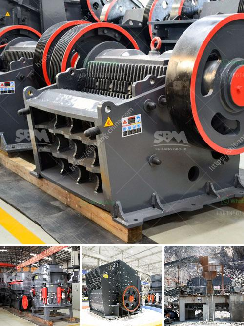

<h3>ball mill grinders cost</h3>
Ball mill grinders are the most widely used type of grinding equipment for reducing particles down to the submicron range. Costing, both initially and over the long-term, is significant. In this article, we will examine the factors influencing the cost of ball mill grinders.

The first factor to consider is the initial cost of purchasing and installing a ball mill grinder. These costs can vary widely, depending on the size and capacity of the equipment, as well as the specific requirements of the application. Small laboratory-scale ball mills can have prices as low as a few hundred dollars, while larger industrial-scale mills can cost several thousand dollars or more.

Another important cost consideration is the operational expenses associated with running the ball mill grinder. These expenses include energy consumption, maintenance and repairs, and grinding media costs. The energy consumption of a ball mill grinder is directly proportional to the power draw of the machine and can be as high as 40-50% of the total energy consumed in a grinding circuit. Minimizing energy consumption can significantly reduce operational costs. Additionally, regular maintenance and timely repairs can prolong the lifespan of the equipment and minimize unexpected downtime, thus reducing costs in the long run. Furthermore, grinding media, such as steel balls or ceramic beads, needs to be replenished periodically, contributing to the operational expenses.

Apart from the initial and operational costs, it is essential to evaluate the overall cost-effectiveness of a ball mill grinder. The cost-effectiveness of a grinder depends on several factors, including the desired particle size distribution, the required production capacity, and the specific characteristics of the material being ground. In some cases, a ball mill grinder may not be the most cost-effective option, and alternative grinding technologies, such as vertical mills or stirred mills, might be more suitable. These alternatives often have higher initial costs but can offer advantages in terms of energy efficiency, maintenance requirements, and product quality.

Finally, it is crucial to consider the total cost of ownership (TCO) when evaluating the cost of ball mill grinders. TCO includes not only the initial purchase and operational costs but also factors in the expected lifespan of the equipment, the availability of spare parts, and the level of technical support provided by the manufacturer. It is recommended to assess different suppliers and their reputation in terms of reliability, customer service, and overall satisfaction.

In conclusion, the cost of ball mill grinders can vary significantly depending on factors such as the size and capacity of the equipment, operational expenses, and overall cost-effectiveness. It is essential to carefully evaluate these factors when selecting a grinder to ensure that the chosen equipment meets the specific needs of the application while offering the best value for money over its lifespan.
<h3>Contact us</h3><ul><li><strong>Whatsapp:&nbsp;<a href="https://wa.me/8613661969651">+8613661969651</a></strong></li><li><a href="https://swt.shibang-china.com/?git&amp;zhl&amp;ball mill grinders cost"><strong>Online Service(chat now)</strong></a></li></ul><h3>Related</h3><ul><li><a href='crusher business aggregate.md'>crusher business aggregate</a></li><li><a href='used philippines jaw crushers.md'>used philippines jaw crushers</a></li><li><a href='stone crusher plant design pdf.md'>stone crusher plant design pdf</a></li><li><a href='chromite processing plant and separation machine.md'>chromite processing plant and separation machine</a></li><li><a href='crushing machine south africa.md'>crushing machine south africa</a></li></ul>