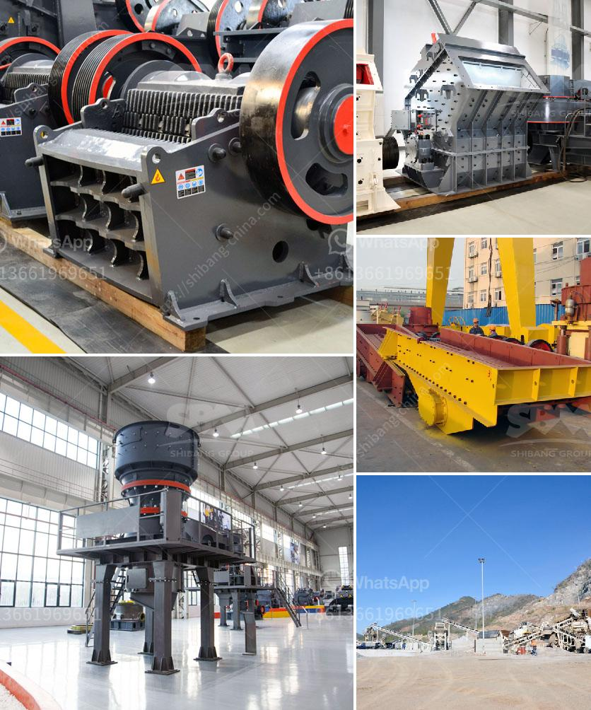

<h3>ball mill in ceramic industry</h3>
The ball mill is a key equipment for grinding materials, widely used in powder-making production line such as cement, silicate sand, new-type building material, refractory material, fertilizer, ore dressing of ferrous metal and non-ferrous metal, glass ceramics, etc. Ball mill can grind various ores and materials with dry type or wet type.

The ceramic industry is a rapidly growing industry, and ball mills are an essential part of the industry in the process of manufacturing high-quality ceramics. As far as the grinding process is concerned, the grinding process in the ball mill is the most common and efficient method of ceramic grinding.

Ball mill is an efficient machine for fine powder grinding and key equipment for grinding after the crushing process. There are two ways of ball mill grinding: the dry way and the wet way. It is used to grind many kinds of mineral ores and other materials, or to select the mine.

In the ceramics industry, ball mills are used in the ceramic production line to grind materials into a certain particle size and further process them into ceramics. The ceramic material is ground to a specified particle size in a ball mill by a combination of impact and grinding.

The ceramic material enters the ball mill evenly through the feeding device and the spiral conveyor. The ceramic product is ground by grinding media in the rotating barrel. The ball mill is lined with ceramic liners to prevent abrasion of the barrel body and make the barrel more resistant to wear.

The ball mill in the ceramics industry has the advantages of small investment and reliable operation. It is an ideal choice for small and medium-sized ceramic factories. It can be used to grind various types of ceramic raw materials in batch or continuous production.

In conclusion, the ball mill is an essential equipment in the ceramics industry, especially in the production of high-quality ceramics. Its grinding efficiency and high capacity promote the continuous growth of the ceramic industry, making it an important process for grinding ceramics.
<h3>Contact us</h3><ul><li><strong>Whatsapp:&nbsp;<a href="https://wa.me/8613661969651">+8613661969651</a></strong></li><li><a href="https://swt.shibang-china.com/?git&amp;zhl&amp;ball mill in ceramic industry"><strong>Online Service(chat now)</strong></a></li></ul><h3>Related</h3><ul><li><a href='concrete crushing plant business plan.md'>concrete crushing plant business plan</a></li><li><a href='gypsum beneficiation plant.md'>gypsum beneficiation plant</a></li><li><a href='rock crusher zenith.md'>rock crusher zenith</a></li><li><a href='screening equipment mining vibrating screen for sale.md'>screening equipment mining vibrating screen for sale</a></li><li><a href='stone quarry crusher machines.md'>stone quarry crusher machines</a></li></ul>