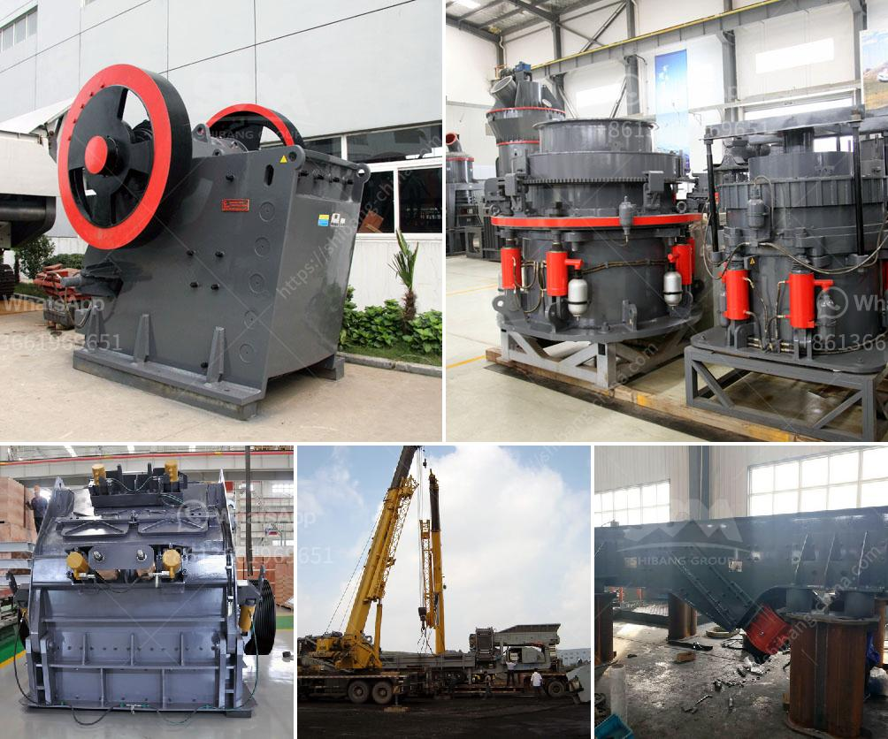

<h3>ball mill in mining</h3>
The ball mill is one of the most widely used equipment in the mining industry. This equipment is widely used in the production of cement, silicate products, new building materials, refractory materials, fertilizers, black and non-ferrous metal beneficiation, and glass ceramics, etc. This grinding equipment has a wide range of applications, and its performance has reached the advanced level in various fields.

The ball mill is mainly composed of a cylinder, a transmission device, an end cover, a bearing, and a driven device. It consists of a grinding medium, a material evenly feeding device, and a discharging device. The cylinder body is filled with a grinding medium (usually steel balls or steel segments). When the ball mill rotates, the grinding medium is brought to a certain height and then falls under the action of centrifugal force, resulting in a pounding and grinding effect on the material.

The ball mill is an essential grinding equipment for concentrators. It is mainly used for grinding operations before sorting. It is equipped with grading equipment for grinding and grading to complete the sorting of minerals. It is widely used in cement, silicate products, and new building materials. Refractory materials, chemical fertilizers, ferrous and non-ferrous metal mineral processing, glass ceramics, and other production industries, for various ores and other grindable materials for dry or wet grinding.

The ball mill is a tumbling mill that uses steel balls as grinding media. Ball mills can be used in wet or dry systems for bulk and continuous milling, and are most widely used in small or large-scale beneficiation plant. The feed can be dry with a water content of less than 3% to minimize the coverage of the ball, or it can be a slurry with a water content of 20-40%. The ball mill can be used for primary or secondary grinding applications. In the primary application, they receive feed from the crusher, and in the secondary application, they receive feed from the rod mill, autogenous mill, or semi-autogenous mill.

The working principle of the ball mill is simple. There are two grinding chambers in the machine, the material evenly enters the first chamber through the feeding port, the chamber has a step liner or a corrugated liner, and is packed with steel balls of different specifications. The rotation of the cylinder generates centrifugal force to bring the steel balls to a certain height and then fall, causing heavy blows and grinding to the material. After the grinding process is completed, the material enters the second chamber through the single-layer partition board, and the chamber is filled with a flat liner and steel balls to further grind the material. When the cylinder is rotating, the steel balls are carried to a certain height by centrifugal force and then fall to grind and discharge the material.

In conclusion, the ball mill is an indispensable equipment in the mining industry. It has a wide range of applications and is favored by users due to its high production efficiency and good energy-saving effect. Nowadays, various types of ball mills have been developed on the market to meet different customers' requirements for various grinding operations. The continuous improvement and development of the ball mill technology will contribute to the prosperity of the mining industry.
<h3>Contact us</h3><ul><li><strong>Whatsapp:&nbsp;<a href="https://wa.me/8613661969651">+8613661969651</a></strong></li><li><a href="https://swt.shibang-china.com/?git&amp;zhl&amp;ball mill in mining"><strong>Online Service(chat now)</strong></a></li></ul><h3>Related</h3><ul><li><a href='grinding mill price in.md'>grinding mill price in</a></li><li><a href='canber de broage ciment.md'>canber de broage ciment</a></li><li><a href='china quarry crushing production line equipment.md'>china quarry crushing production line equipment</a></li><li><a href='crushing and screening machinery.md'>crushing and screening machinery</a></li><li><a href='mobile crusher 150 tons capacity.md'>mobile crusher 150 tons capacity</a></li></ul>