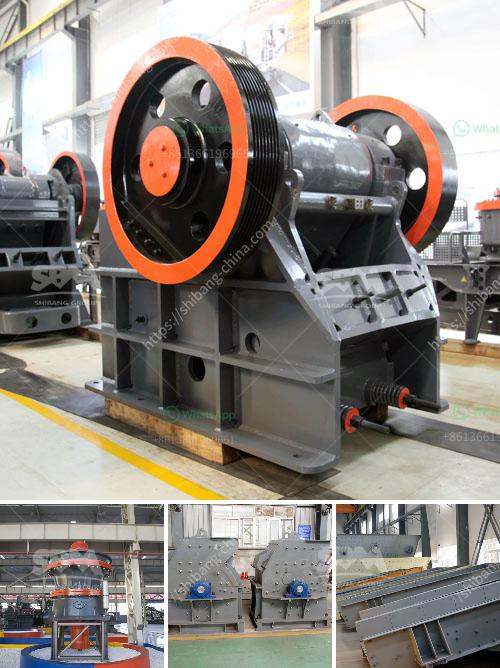

<h3>ball mill in work</h3>
Ball mill is a kind of grinding machine, which also has mixing effect. The body of ball mill is cylindrical, which is loaded with spherical grinding body and materials; the centrifugal force and friction force generated by the rotation of the body, the material and grinding body will be taken to a certain height and falls at the same time. After continuous mutual impact and friction, the material is ground into the required fineness by the action of grinding medium and grinding body in the cylinder. Under the action of grinding medium, the ore particles gradually become smaller, and the particle size of discharge from the ore mouth becomes smaller. The ball mill is simple in structure, low in manufacturing and maintenance cost, high in efficiency and uniform in particle size when operating.

The ball mill is a typical material grinder machine which widely used in the mineral processing plant, ball mill performs well in different material conditions either wet type grinding or dry type, and to grind the ores to a fine size. Main ball mill components: cylinder, motor drive, grinding medium, shaft. The cylinder cavity is partial filling with the material to be ground and the metal grinding balls. When the large cylinder rotates, it creates centrifugal force which will elevate the steel ball and material to a certain height and falls down, then the ore is also moving like a vortex in this process, the ball mill will grind the ore into powder. The final size of the materials is controlled by the size of the grinding medium. Due to the long operation time of ball mill, the steel balls will wear out, but the filling rate of steel balls in the cylinder body is relatively low. In order to maintain the normal operation of the ball mill, maintain the appropriate amount of steel balls is necessary.

The ball mill installation and commissioning is completed in the factory. So the user only needs to connect the equipment to the power supply and water supply, so as to make it work. Moreover, during the working process of the ball mill, it is necessary to check whether the bearing of the equipment is overheated regularly. Moreover, in order to make the equipment work better, regular maintenance activities are required, such as adding grease to each lubrication point of the equipment on time, etc.

Ball mill is an important equipment in grinding operation, and the fineness of ball mill is one of the main factors affecting the mineral processing index. In the entire beneficiation process of a concentrator, grinding operation cost accounts for a considerable proportion. There are four types of grinding operation of ball mill: dissociative grinding, pulverizing grinding, scrub-type grinding, and ultra-fine pulverizing grinding. While the grinding fitness of an ore determines the effectiveness of grinding, the front factor should be carried out with mineral processing test to confirm the grinding fitness to reduce the cost. Also, the grinding efficiency of ball mill will reduce. If the steel ball is too small, or the filling rate of the grinding body is insufficient, the grinding effect of the ball mill will be reduced. Therefore, the grinding system of ball mill should adopt the following measures to improve grinding efficiency:

1. Reduce the size of the grinding body, reduce the filling rate of the ball mill and improve the ratio of ball to material. Usually, the ratio of ball to material can be calculated by 1:1, but for ultra-fine ball mill, due to the relatively small ball and high difficulty of research and production, there will be less filling rate of ball to material, which is generally based on 4:3;

2. Choose reasonable steel ball and liner. The hardness ratio of ball mill liner and steel ball should be controlled within a reasonable range, which can avoid excessive wear of steel ball and liner in ball mill;

3. Optimize the structure of ball mill equipment. The ball mill structure can be streamlined, with a smaller area occupation and can reduce dynamic and static friction loss;

4. Improve the grinding efficiency. According to the measurement of wear rate or wear strength of lining plate, one can determine the appropriate grinding method of steel ball inside ball mill.

Ball mill usage and application have improved effectively by optimizing the structure and performance. The ball mill is an efficient grinding equipment and is widely used in powder-making, production line including cement, silicate, new-type building material, refractory material, fertilizer, ore dressing of ferrous metal and non-ferrous metal, glass ceramics, etc. As such, ball mill has a wide range of applications and can be used in various industries.
<h3>Contact us</h3><ul><li><strong>Whatsapp:&nbsp;<a href="https://wa.me/8613661969651">+8613661969651</a></strong></li><li><a href="https://swt.shibang-china.com/?git&amp;zhl&amp;ball mill in work"><strong>Online Service(chat now)</strong></a></li></ul><h3>Related</h3><ul><li><a href='open pit mobile crushing plant.md'>open pit mobile crushing plant</a></li><li><a href='chrome crushing plant.md'>chrome crushing plant</a></li><li><a href='crushing plant in calatagan batangas.md'>crushing plant in calatagan batangas</a></li><li><a href='100 tph stone crushers with vsi in india.md'>100 tph stone crushers with vsi in india</a></li><li><a href='difference betweren jaw crusher and impact crusher.md'>difference betweren jaw crusher and impact crusher</a></li></ul>