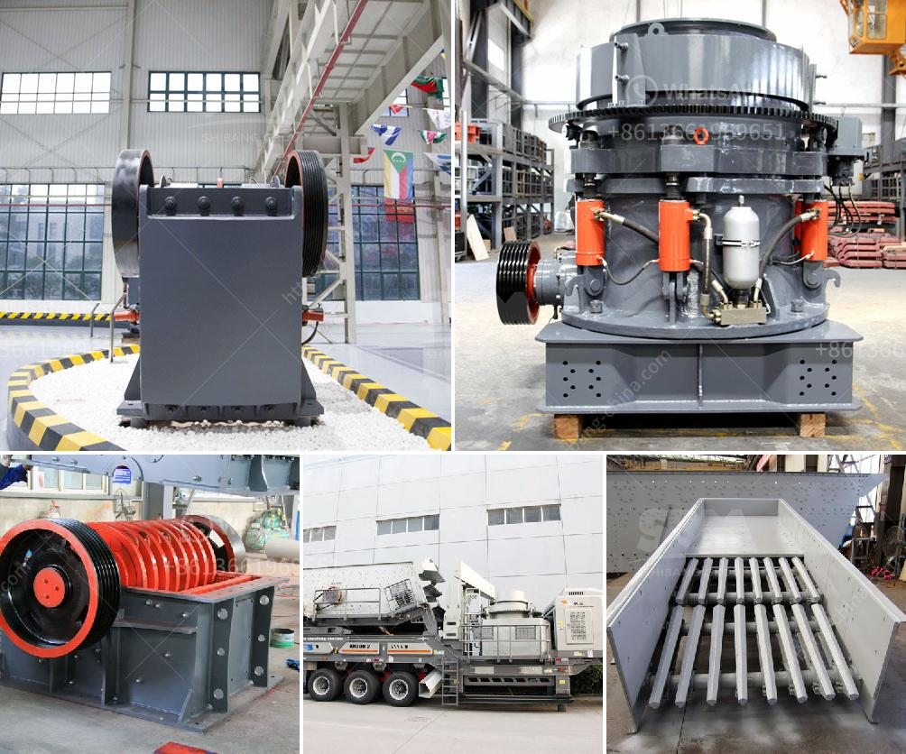

<h3>ball mill iran mining</h3>
The ball mill is a key equipment for grinding materials, widely used in powder-making production line such as cement, silicate sand, new-type building material, refractory material, fertilizer, ore dressing of ferrous metal and non-ferrous metal, glass ceramics, etc. Ball mill can grind various ores and materials with dry type or wet type. There are two kinds of ball mills, grate type and overflow type due to different ways of discharging material.

Iran is a growing market for ball mills but the stringent regulations and export control regime make it challenging for companies to export their products to the country. However, the mining industry in Iran has witnessed a rapid expansion in recent years, and with its vast mineral resources, Iran could become one of the major players in the global mining market.

Iran is known for its abundance of natural resources, particularly minerals such as copper, zinc, lead, and iron ore. The country has the fourth-largest proven oil reserves and the second-largest natural gas reserves in the world. With such vast resources, it is imperative for Iran to develop its mining sector and maximize the potential of its mineral wealth.

The ball mill plays a vital role in the mining process as it grinds and crushes ore into a fine powder to release the valuable minerals contained within the rock. Mining generates substantial revenues for Iran, as it is the leading exporter of countries in the Middle East. The introduction of advanced mining equipment, such as ball mills, will help drive the country’s economy further.

With the recent lifting of economic sanctions, Iran is looking to attract foreign investment in its mining sector. The government has introduced various incentives and exemptions to encourage foreign companies to invest in mining projects. These measures include tax incentives, royalty exemptions, and reduced import tariffs on mining equipment and machinery.

In order to meet the growing demand for ball mills in Iran's mining sector, several companies have started manufacturing their equipment in the country. This not only helps support the local economy but also reduces the dependence on imports and foreign technology. Additionally, local production allows for customization of the equipment to better suit the specific needs of the Iranian mining industry.

Despite the challenges and restrictions, the ball mill market in Iran has tremendous growth potential. The government's commitment to developing the mining sector, coupled with the abundant natural resources and rising global demand for minerals, makes Iran an attractive market for ball mill manufacturers.

In conclusion, the ball mill plays a crucial role in the mining industry, particularly in Iran's rapidly expanding mining sector. With its vast mineral resources and government support, Iran has the potential to become a major player in the global mining market. The local production of ball mills further strengthens the country's mining industry and reduces dependence on imports. As Iran continues to attract foreign investment, the ball mill market in the country is expected to witness significant growth in the coming years.
<h3>Contact us</h3><ul><li><strong>Whatsapp:&nbsp;<a href="https://wa.me/8613661969651">+8613661969651</a></strong></li><li><a href="https://swt.shibang-china.com/?git&amp;zhl&amp;ball mill iran mining"><strong>Online Service(chat now)</strong></a></li></ul><h3>Related</h3><ul><li><a href='iron ore beneficiation plant suppliers.md'>iron ore beneficiation plant suppliers</a></li><li><a href='hammer mill price in nigeria.md'>hammer mill price in nigeria</a></li><li><a href='washing machine for small scale mining in ghana.md'>washing machine for small scale mining in ghana</a></li><li><a href='crusher size 1 ton capacity hour.md'>crusher size 1 ton capacity hour</a></li><li><a href='screen crusher for sale.md'>screen crusher for sale</a></li></ul>