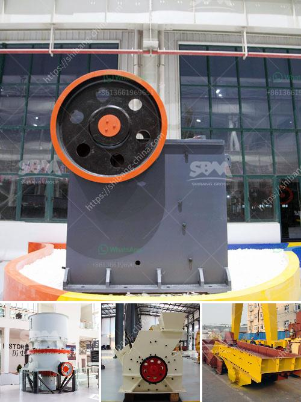

<h3>ball mill machine price in india</h3>
Ball mill machine price in India reflects the quality and brand value of a ball mill machine. There are plenty of ball mill manufacturers in India but the options for a high-quality machine are limited. As we all know, ball mill is an important equipment used to grind materials into fine powder. It is widely used in thermal power plants, cement, chemicals, glass, ceramics and other industries. However, buying a good quality ball mill machine is often a challenging task, especially for those who are new to the industry.

The ball mill machine price in India is influenced by several factors, including the machine's brand, quality, capacity, and overall performance. In order to get the best price, customers should take these factors into consideration and choose a reputable brand. Besides, considering the cost-effectiveness of the machine is also necessary. It means that the machine should not only have an affordable price but also offer outstanding performance and durability.

It is always a good idea to do some research before purchasing a ball mill machine in India. Look for reviews and opinions from customers who have already bought the machine from the particular brand or manufacturer. This can give you valuable insights into the machine's performance and reliability. Additionally, checking the warranty and after-sales service offered by the manufacturer is crucial. A reliable manufacturer will provide sufficient warranty coverage and comprehensive technical support.

In terms of capacity, the ball mill machine price in India will vary depending on the specific capacity. For instance, machines with a larger capacity will generally have a higher price tag. It is important to analyze your requirements and opt for a machine that can meet your production needs without overpaying for unnecessary capacity. Remember, always choose a machine that offers the best value for your investment.

Apart from the machine itself, the ancillary equipment needed for the ball mill operation should also be taken into account when considering its price. Equipment such as grinding media, liners, and energy-saving equipment can also affect the overall cost. Therefore, make sure to inquire about these additional expenses and carefully evaluate their importance to your operation.

Lastly, it is recommended to compare prices from different suppliers or manufacturers before making a final decision. This will help ensure that you are getting the best price for the ball mill machine in India. However, price should not be the sole determining factor. Always prioritize quality and performance over a lower price, as a good quality machine will deliver better results and have a longer lifespan.

In conclusion, the ball mill machine price in India varies depending on factors such as brand, quality, capacity, and ancillary equipment. It is important to do thorough research, consider customer reviews, warranty coverage, and after-sales service, and compare prices from different suppliers to make an informed decision. By focusing on quality and performance, customers can find a high-quality ball mill machine that offers excellent value for their investment.
<h3>Contact us</h3><ul><li><strong>Whatsapp:&nbsp;<a href="https://wa.me/8613661969651">+8613661969651</a></strong></li><li><a href="https://swt.shibang-china.com/?git&amp;zhl&amp;ball mill machine price in india"><strong>Online Service(chat now)</strong></a></li></ul><h3>Related</h3><ul><li><a href='crusher primary cone crusher.md'>crusher primary cone crusher</a></li><li><a href='stone sand making process pdf.md'>stone sand making process pdf</a></li><li><a href='ball mill constraction.md'>ball mill constraction</a></li><li><a href='stone crusher saudi.md'>stone crusher saudi</a></li><li><a href='1000 ton crusher.md'>1000 ton crusher</a></li></ul>