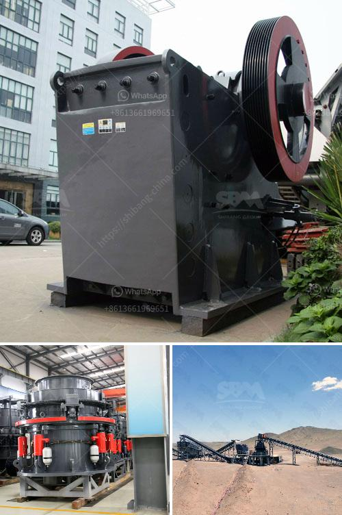

<h3>ball mill manufacture in chennai</h3>
A ball mill is a cylindrical machine created for the purpose of grinding and blending materials. The major components of this machine include a rotating hollow cylinder, placed externally with a horizontal axis, and an attached grinding medium located inside the cylinder. Ball mills are commonly used in the production of fine powders that are used in various industries such as paint, ceramics, pyrotechnics, and sugar.

In Chennai, the capital city of Tamil Nadu, known for its industrial prowess, various industries rely on ball mills to carry out important manufacturing procedures. Many companies in Chennai deal with the designing, manufacturing, and supplying of various types of ball mills to customers in this city and beyond.

One of the key players in this field is a ball mill manufacturer called Chennai Automatic Equipment Pvt Ltd (CAEPL). Based in Chennai, CAEPL has been involved in the manufacturing and supply of various types of ball mills for over three decades. They have a vast experience in this industry and offer technical expertise to their customers. CAEPL is known for its high-quality products, excellent customer service, and timely delivery.

The ball mills manufactured by CAEPL are designed to cater to the diverse needs of different industries. They provide ball mills in various sizes, shapes, and capacities, depending on the requirements of the customers. These ball mills are made using high-quality materials and advanced manufacturing techniques to ensure durability, efficiency, and reliability. The company also provides customization options to suit the specific needs of its customers.

One of the key advantages of choosing a ball mill manufactured by CAEPL is its efficiency in grinding and blending materials. These machines are designed to deliver superior performance, allowing businesses to produce fine powders that meet their specific requirements. The rotating cylinder inside the ball mill creates a centrifugal force that helps in grinding and blending the materials effectively. The grinding medium, usually made of steel balls, further aids in the grinding process.

Another advantage of using CAEPL's ball mills is their low maintenance requirements. The company ensures that its products are built to last, requiring minimal maintenance and repairs. This allows businesses in Chennai to focus on their manufacturing processes without worrying about the reliability of their equipment.

In conclusion, ball mills are a crucial tool in various industries for grinding and blending materials. Chennai, being an industrial hub, relies on manufacturers like CAEPL to provide high-quality ball mills to cater to the needs of its diverse industries. CAEPL's ball mills are known for their efficiency, reliability, and low maintenance requirements. With their vast experience in the field, CAEPL is considered a trusted name in Chennai's ball mill manufacturing industry.
<h3>Contact us</h3><ul><li><strong>Whatsapp:&nbsp;<a href="https://wa.me/8613661969651">+8613661969651</a></strong></li><li><a href="https://swt.shibang-china.com/?git&amp;zhl&amp;ball mill manufacture in chennai"><strong>Online Service(chat now)</strong></a></li></ul><h3>Related</h3><ul><li><a href='purification process of iron ore.md'>purification process of iron ore</a></li><li><a href='price list jaw crusher 150 x 200mm.md'>price list jaw crusher 150 x 200mm</a></li><li><a href='used stone crusher machine price.md'>used stone crusher machine price</a></li><li><a href='conical ball mill for sale.md'>conical ball mill for sale</a></li><li><a href='the estimated cost of setting up a quarry.md'>the estimated cost of setting up a quarry</a></li></ul>