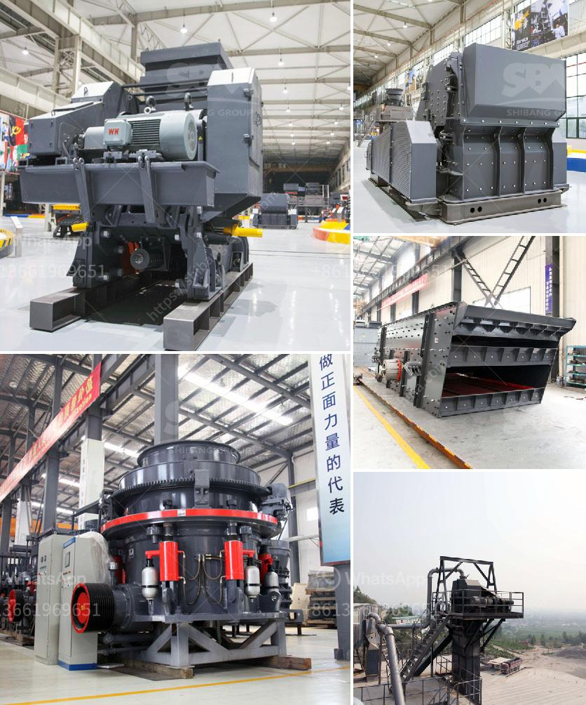

<h3>ball mill manufacturer in inammedabad</h3>
Ball mill manufacturer in Ahmedabad is one such lucrative business that has a strong presence not only in national but also international markets. This thriving industry is backed by a skilled workforce and robust infrastructure, making Ahmedabad a hub for ball mill manufacturing. 

Ahmedabad, also known as the Manchester of India, is renowned for its industrial prowess. It has a long history of manufacturing excellence and has constantly adapted to the latest technology and market demands. With a large number of companies operating in the engineering and manufacturing sectors, Ahmedabad has become a preferred destination for setting up manufacturing units.

Ball mills are extensively used for grinding materials in diverse industries such as cement, mineral processing, paint, pyrotechnics, ceramics, and selective laser sintering. The key advantage of a ball mill is its ability to pulverize materials into fine particles, thus facilitating the production of high-quality end products. This has made ball mills an indispensable machine in various manufacturing processes.

The ball mill manufacturing industry in Ahmedabad has seen significant growth due to its excellent R&D capabilities and technical expertise. The manufacturers in the region are constantly striving to improve the efficiency and performance of ball mills by incorporating innovative design and technology. This has resulted in the development of advanced ball mill models that offer higher production capacities, reduced energy consumption, and enhanced product quality.

The ball mill manufacturers in Ahmedabad cater to both domestic and international markets. They have a strong global presence and export their products to various countries across the globe. The manufacturers ensure strict quality control measures at every stage of production to deliver reliable and durable ball mills that meet international quality standards.

In conclusion, the ball mill manufacturing industry in Ahmedabad is thriving due to its skilled workforce, robust infrastructure, and commitment to innovation. The manufacturers in this region are continually striving to enhance the performance and efficiency of ball mills. With their focus on quality and customer satisfaction, they have successfully established themselves as significant players in the global market.
<h3>Contact us</h3><ul><li><strong>Whatsapp:&nbsp;<a href="https://wa.me/8613661969651">+8613661969651</a></strong></li><li><a href="https://swt.shibang-china.com/?git&amp;zhl&amp;ball mill manufacturer in inammedabad"><strong>Online Service(chat now)</strong></a></li></ul><h3>Related</h3><ul><li><a href='jaw crusher in uzbekistan.md'>jaw crusher in uzbekistan</a></li><li><a href='rotary kiln manufacturers.md'>rotary kiln manufacturers</a></li><li><a href='vibratory ball mill china.md'>vibratory ball mill china</a></li><li><a href='crushing processing equipment.md'>crushing processing equipment</a></li><li><a href='china ultra fine grinders mill.md'>china ultra fine grinders mill</a></li></ul>