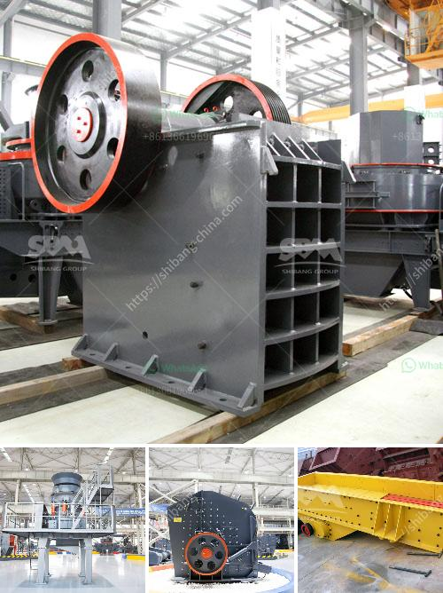

<h3>ball mill manufacturers in malaysia</h3>
Ball mill manufacturers in Malaysia are constantly striving to provide the best grinding efficiency for mining industry players. With a wide array of options, manufacturers can customize the equipment to meet industry demands and constantly supply grinding products that maintain the highest standards.

Ball mills are typically used in the mining industry to grind materials into fine powders for further processing. The ball mill is a crucial piece of equipment for grinding crushed materials, and it is widely used in production lines for powders such as cement, silicates, refractory material, fertilizer, glass ceramics, etc.

Malaysia's ball mill manufacturers have been offering used ball mills for over 15 years, giving customers a complete solution to grind various particles into finer substances. The machines can be used in many industries, such as mining, chemical, refractory, and cement.

One of the key factors customers look for in a ball mill manufacturer is the ability to provide machines that have a long lifespan and can withstand harsh working conditions. Malaysian manufacturers have proven their expertise in this area by producing highly durable ball mills that can operate for years without any significant wear and tear.

In addition to durability, customers also expect high grinding efficiency to maximize their productivity. Ball mills from Malaysia's manufacturers are known for their consistent grinding performance, ensuring that the particles are ground to the desired size with minimal energy consumption. Additionally, these mills are equipped with advanced control systems that allow operators to closely monitor the grinding process and make necessary adjustments in real-time.

Another advantage of working with ball mill manufacturers in Malaysia is their ability to provide customized solutions. Manufacturers can tailor the equipment to meet specific requirements, such as the type of grinding media, the desired particle size distribution, or the capacity of the mill. This flexibility allows customers to optimize their grinding operations and achieve the desired results.

In conclusion, ball mill manufacturers in Malaysia are dedicated to providing efficient and high-quality grinding equipment to meet the demands of the mining industry. Their durable machines are designed to withstand harsh working conditions and offer optimal grinding efficiency. With their ability to provide customized solutions, these manufacturers ensure that customers can achieve their desired grinding outcomes.
<h3>Contact us</h3><ul><li><strong>Whatsapp:&nbsp;<a href="https://wa.me/8613661969651">+8613661969651</a></strong></li><li><a href="https://swt.shibang-china.com/?git&amp;zhl&amp;ball mill manufacturers in malaysia"><strong>Online Service(chat now)</strong></a></li></ul><h3>Related</h3><ul><li><a href='portable stone crusher plant.md'>portable stone crusher plant</a></li><li><a href='mobile dimension stone processing dressing cutting.md'>mobile dimension stone processing dressing cutting</a></li><li><a href='cost of stone crusher in kenya.md'>cost of stone crusher in kenya</a></li><li><a href='talcum powder mill manufacturing.md'>talcum powder mill manufacturing</a></li><li><a href='mineral material crusher.md'>mineral material crusher</a></li></ul>