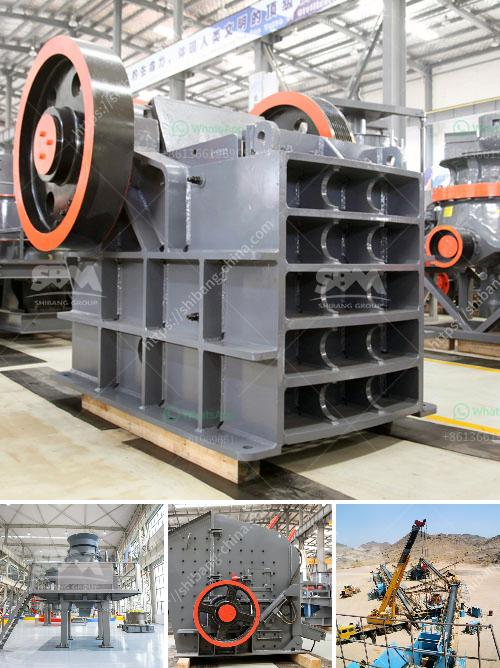

<h3>ball mill media suppliers</h3>
When it comes to ball mills, there is no doubt that they are indispensable tools for mineral processing operations. However, it is important to find the right ball mill media supplier that can cater to your unique needs. To ensure optimal performance of your ball mill, it is crucial to choose suitable grinding media that will maintain the integrity of the grinding media and offer superior grinding efficiency.

There are various types of ball mill media suppliers in the market, each with their own set of advantages and disadvantages. In this article, we will discuss the key factors to consider when selecting a ball mill media supplier.

First and foremost, it is essential to evaluate the quality of the grinding media offered by the supplier. High-quality grinding media should be able to withstand the harsh conditions inside a ball mill, such as the impact and wear generated during the grinding process. Inferior quality grinding media may break or wear out quickly, leading to frequent downtime and increased costs.

One way to assess the quality of the grinding media is by looking at its material composition. Common materials used for manufacturing grinding media include steel, ceramic, and high chrome. Steel grinding media, such as stainless or carbon steel balls, are widely used due to their high strength and durability. Ceramic grinding media, on the other hand, are known for their excellent wear resistance and chemical stability. High chrome grinding media offer exceptional wear resistance but are more expensive compared to other options.

Another important consideration when selecting a ball mill media supplier is the availability and pricing of their products. It is crucial to choose a supplier with a wide range of options to suit different grinding applications. Additionally, cost-effectiveness is a key factor, as high-quality grinding media should provide a good balance between performance and price.

Furthermore, it is essential to ensure that the ball mill media supplier understands your specific needs and can provide tailored solutions. Different grinding applications may require specific grinding media characteristics. For example, in fine grinding applications, smaller grinding media such as ceramic beads or balls may be preferred to achieve higher grinding efficiency. A reliable supplier should be able to provide expert advice and recommendations based on your specific requirements.

Lastly, it is recommended to consider the reputation and track record of the ball mill media supplier. A supplier with a proven track record in providing high-quality grinding media and excellent customer service is more likely to meet your expectations. Reading customer reviews and testimonials can also help gauge the supplier's reliability and overall satisfaction of their clients.

In conclusion, choosing the right ball mill media supplier is crucial for optimal performance of your ball mill. Assessing the quality, availability, and pricing of the grinding media, as well as the supplier's expertise and reputation, will help guarantee a successful grinding process. Investing in high-quality grinding media from a reputable supplier will ultimately lead to improved productivity, reduced downtime, and cost savings in the long run.
<h3>Contact us</h3><ul><li><strong>Whatsapp:&nbsp;<a href="https://wa.me/8613661969651">+8613661969651</a></strong></li><li><a href="https://swt.shibang-china.com/?git&amp;zhl&amp;ball mill media suppliers"><strong>Online Service(chat now)</strong></a></li></ul><h3>Related</h3><ul><li><a href='used sand wash plant for sale.md'>used sand wash plant for sale</a></li><li><a href='stone crushing production line zenith.md'>stone crushing production line zenith</a></li><li><a href='turkish supplier for phosphate ball mill.md'>turkish supplier for phosphate ball mill</a></li><li><a href='the product of the stone crusher.md'>the product of the stone crusher</a></li><li><a href='germany made gypsum block wall equipment.md'>germany made gypsum block wall equipment</a></li></ul>