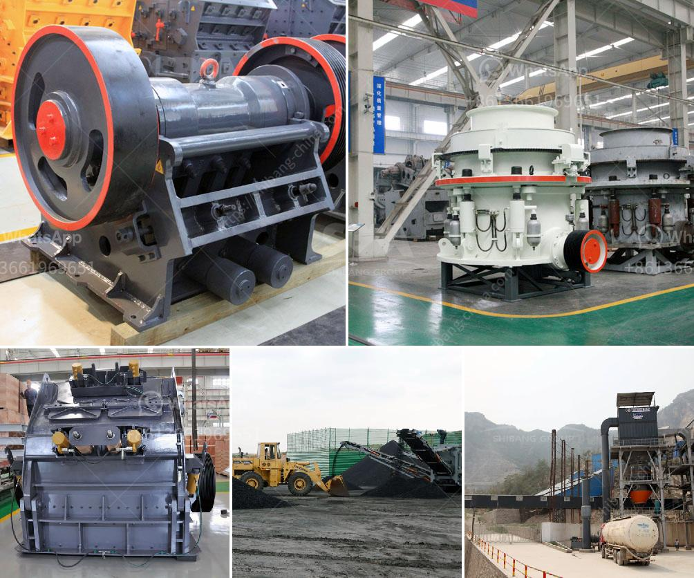

<h3>ball mill suppliers in india</h3>
Ball Mill is the key equipment for grinding, and the Gujarat Engineering company has been manufacturing ball mill with various industrial applications over the years. With experience in designing and manufacturing reliable and efficient ball mills, our experts have put in continuous research and development efforts to produce high-quality grinding equipment that meets international standards.

India is known as the prolific hub of grinding equipment manufacturers, as all the leading manufacturers have their factories and production units in this country. The sprawling infrastructure, coupled with favorable government policies, has made India a favorable destination for leading ball mill suppliers from all over the world.

One such company that has been serving its clients for over three decades is the Gujarat Engineering company. Their state-of-the-art manufacturing unit and strong customer-centric approach have made them a reliable and preferred choice for countless industries.

The ball mill suppliers in India have gained immense prominence in the recent years and they have been able to gather a huge clientele across India. The Gujarat Engineering company is one of the pioneer manufacturers and suppliers of ball mill. Our company has been in existence since 1980 and almost three decades we have gained immense expertise in the field of manufacturing ball mills.

Ball mills are designed to grind and mix dry powder samples. A laboratory ball mill consists of ball grinding tank (jar) made of stainless steel. Steel balls of different sizes are put inside the jar; help grinding and mixing samples in high-speed one-way movement. We are a trusted laboratory ball mill manufacturer in India, offering a wide range of ball mills in different technical specifications.

Our company has gained fame and name in the manufacturing and exporting of Ball Mill. The ball mill is used to grind many kinds of row materials. There are two ways of grinding: the dry process and the wet process. It can be divided into tubular type and flowing type according to different forms of discharging material.

"Efficiency, Reliability, and Quality," are the three cornerstones of our company and we constantly strive to deliver cutting-edge solutions to our clients. With a strong emphasis on customer satisfaction, we are always ready to go the extra mile to ensure that our clients get the best value for their investment.

Our team consists of highly skilled engineers and technicians who are committed to providing high-quality ball mills that match global standards. Moreover, we have a well-equipped manufacturing facility that enables us to produce ball mills in bulk quantities as per the requirements of our clients.

We are proud to declare that we have supplied ball mills to reputed industries in India and several other countries. Some of our prestigious clients include BHEL, Crompton Greaves, Rallis India, Reliance Industries, Savita Chemicals, Tata Chemicals, and many more.

In conclusion, the ball mill suppliers in India have gained a strong foothold in the domestic market and have also made their presence felt in the international market. They manufacture high-quality ball mills that are extensively used in various industrial sectors across the country. This is a testament to their ability to combine superior technology and manufacturing expertise to deliver top-notch equipment to their clients.
<h3>Contact us</h3><ul><li><strong>Whatsapp:&nbsp;<a href="https://wa.me/8613661969651">+8613661969651</a></strong></li><li><a href="https://swt.shibang-china.com/?git&amp;zhl&amp;ball mill suppliers in india"><strong>Online Service(chat now)</strong></a></li></ul><h3>Related</h3><ul><li><a href='ball mill machine price in india.md'>ball mill machine price in india</a></li><li><a href='gold mining equipment from japan.md'>gold mining equipment from japan</a></li><li><a href='gypsum ceiling plant price in pakistan.md'>gypsum ceiling plant price in pakistan</a></li><li><a href='used raymond mill for sale in india.md'>used raymond mill for sale in india</a></li><li><a href='concrete crusher for rent qatar.md'>concrete crusher for rent qatar</a></li></ul>