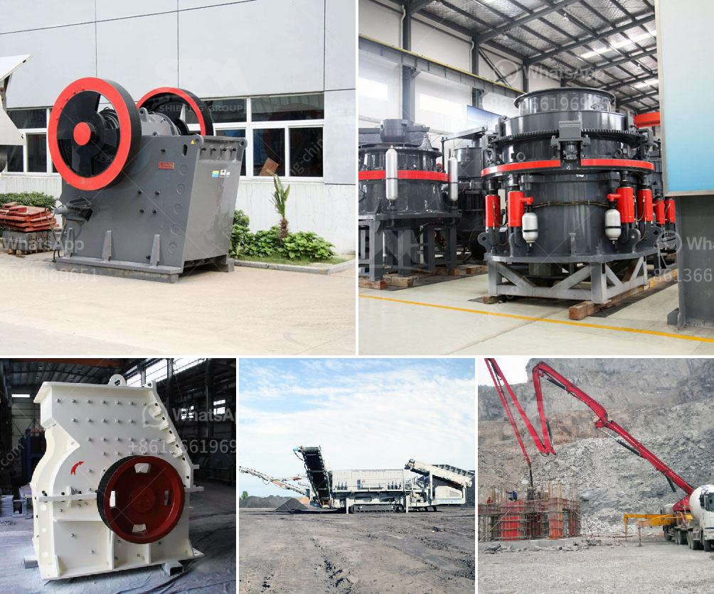

<h3>ball mill suppliers india stone crusher machine</h3>
India is one of the prominent ball mill suppliers in the world. The country is rich in mineral resources and is the leading exporter of numerous minerals. Some of the minerals include manganese, bauxite, limestone, chrome, and graphite. There are various businesses involved in the manufacturing of ball mills in the country, but not all of them provide top-quality products.

When it comes to purchasing a ball mill, it is crucial to choose a reliable supplier that offers superior quality machines. The key to finding the right supplier lies in doing thorough research, considering factors such as reputation, experience, customer reviews, and the range of products they offer.

One of the renowned ball mill suppliers in India is Promas Engineers. They manufacture and supply quality machinery, including stone crushers, grinders, and ball mills. The company offers state-of-the-art technology that produces efficient and reliable machines at competitive prices.

The ball mill is a crucial piece of equipment for grinding crushed materials. Whether it is mineral processing, cement, ceramics, or chemicals, it requires highly efficient and durable machinery to get the job done. Promas Engineers provides just that.

Promas Engineers' ball mills are widely used in various applications due to their high efficiency and reliable performance. The company offers different types of ball mills, including continuous ball mills, batch type ball mills, and octagonal type ball mills. These mills are designed to grind different materials and can operate continuously for long hours.

In addition to ball mills, Promas Engineers also manufactures stone crushers. These machines are used for crushing stones into smaller sizes, making it easier to handle and transport. Stone crushers are extensively used in the mining industry, where they are utilized to break down large rocks into smaller stones. They are also used in construction projects to produce aggregates, making them essential machinery for various applications.

Promas Engineers' stone crushers are made with high-quality materials, ensuring their durability and efficiency. The company designs and manufactures crushers of different sizes and capacities, catering to the diverse needs of their clients.

When it comes to choosing a ball mill supplier in India, one must consider the overall quality, reliability, and after-sales service offered by the supplier. Promas Engineers tick all these boxes with their top-quality products and excellent customer service. They have a team of highly skilled engineers who can provide comprehensive support and assistance to clients.

In conclusion, India is home to some of the top ball mill suppliers in the world. Promas Engineers is one such company that offers high-quality ball mills and stone crushers. With their state-of-the-art technology and excellent customer service, they have become a trusted name in the industry. Whether you need a ball mill or a stone crusher, Promas Engineers can provide you with the best machinery that meets your requirements.
<h3>Contact us</h3><ul><li><strong>Whatsapp:&nbsp;<a href="https://wa.me/8613661969651">+8613661969651</a></strong></li><li><a href="https://swt.shibang-china.com/?git&amp;zhl&amp;ball mill suppliers india stone crusher machine"><strong>Online Service(chat now)</strong></a></li></ul><h3>Related</h3><ul><li><a href='how much crusher cost.md'>how much crusher cost</a></li><li><a href='sand stone crusher.md'>sand stone crusher</a></li><li><a href='mines de cobalt de cuivre de la zambie.md'>mines de cobalt de cuivre de la zambie</a></li><li><a href='second hand raymond mill in india.md'>second hand raymond mill in india</a></li><li><a href='high capacity ball mill malaysia.md'>high capacity ball mill malaysia</a></li></ul>