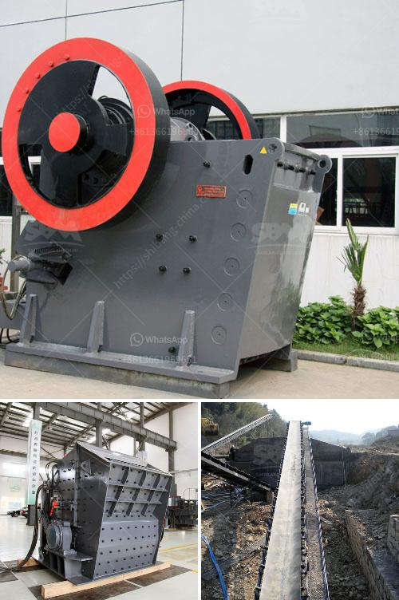

<h3>ball mill work rules</h3>
Ball mills are a fundamental part of the manufacturing industry in the USA as well as around the world. Ball mills crush material into various sizes and extract resources from mined materials. Pebble mills are a type of ball mill and are also used to reduce the size of hard materials, down to 1 micron or less. Because of their fairly simple design, ball mills have a number of important work rules that help to ensure safe and efficient operation.

When working with ball mills, it is essential to wear appropriate PPE to protect the operator from any potential hazards. This includes safety glasses, hearing protection, gloves, and steel-toed footwear. PPE helps prevent injuries that can occur due to spills, explosions, or flying debris.

Regular inspection and maintenance play a critical role in the safe and efficient operation of ball mills. Operators should regularly inspect the mill's components for wear or damage and perform any necessary repairs or replacements promptly. Lubrication of the mill's moving parts should be regularly checked and maintained according to the manufacturer's instructions.

Improper loading or unloading of materials in a ball mill can result in uneven distribution and inefficient grinding. It is essential to load the mill with the correct amount of material and ensure that the loading and unloading process is carried out safely. Overloading the mill can lead to excessive wear and damage to the equipment.

The rotational speed of the ball mill should be carefully monitored and adjusted according to the type and size of the material being processed. The direction of rotation should always be consistent with the manufacturer's recommendations. Sudden changes in speed or rotation direction can cause damage to the mill or result in accidents.

Cleaning ball mills after use is crucial to ensure the longevity and reliable operation of the equipment. Operators must follow strict safety procedures during the cleaning process. This includes shutting down and isolating the equipment, securing the power supply, and using appropriate cleaning agents and tools. It is also important to allow the mill to cool down before attempting any cleaning activities.

Waste generated during the operation and maintenance of ball mills should be disposed of in accordance with local regulations and best practices. This may include the proper containment and labeling of hazardous materials. Operators should be trained on appropriate waste disposal procedures to minimize environmental impact.

In conclusion, following these work rules for ball mill operation is essential for maintaining a safe and efficient working environment. Personal protective equipment, regular inspections, proper loading and unloading, speed and rotation control, safe cleaning practices, and responsible waste disposal are all critical aspects of operating ball mills. By adhering to these rules, operators can help to ensure the longevity of the equipment, prevent accidents, and contribute to a more sustainable manufacturing industry.
<h3>Contact us</h3><ul><li><strong>Whatsapp:&nbsp;<a href="https://wa.me/8613661969651">+8613661969651</a></strong></li><li><a href="https://swt.shibang-china.com/?git&amp;zhl&amp;ball mill work rules"><strong>Online Service(chat now)</strong></a></li></ul><h3>Related</h3><ul><li><a href='granite quarrying process.md'>granite quarrying process</a></li><li><a href='concrete crushing plant business plan.md'>concrete crushing plant business plan</a></li><li><a href='full crushing plants germiston.md'>full crushing plants germiston</a></li><li><a href='gypsum beneficiation process.md'>gypsum beneficiation process</a></li><li><a href='limestone grinding machine.md'>limestone grinding machine</a></li></ul>