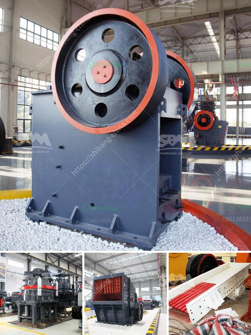

<h3>ball mills for mining price</h3>
Ball mills are a fundamental part of the mining industry for the comminution of minerals into smaller particles. The market for ball mills can be segmented based on types of mills viz., drum ball mill, jet-mill, bead-mill, horizontal rotary ball mill, and vibration ball mill. Along with these types, there is another type of ball mill called planetary ball mill.

Planetary ball mill are small in size and takes less space compared to other ball mills and hence is used mainly in laboratory, for grinding samples into smaller particles. These ball mills find extensive applications in the chemical industry, where the challenge is to have the synthesis which is free of any solvents, such as water, supercritical carbon dioxide (CO2) or ionic liquids, presence of which makes the synthesis hazardous.

The global ball mill (mining) market is segmented on the basis of type, application and geography. The global Ball Mill market was valued at US$ XX.X Mn in 2018 and is projected to increase significantly at a CAGR of x.x% from 2019 to 2028. Ball Mill Market Scope:

By type, the market is segmented into Wet grinding Ball Mill and Dry grinding Ball Mill. By application, the market is divided into Metal Mining and Mineral Mining.

Based on geography, market is analyzed across North America, Europe, Asia-Pacific, Latin America and Middle East and Africa. Major players profiled in the report include DCD, Shenyang Metallurgy, Metso, Furukawa, KHD Humboldt Wedag, Gebr. Pfeiffer, Outotec, MIKRONS, CITIC HIC, Pengfei Group, Henan Hongji Mine, Hongxing Global and Shanghai Minggong.

In the years to come, market players are expected to focus on product innovation in order to stay competitive in the market. Furthermore, they are anticipated to focus on mergers and acquisitions, as well as joint ventures in order to expand their presence in the market.

In conclusion, ball mill is a necessary equipment for the mining industry, with the capability to perform efficiently in all types of conditions and locations. As a result, it has become a standard piece of equipment in industries that require grinding materials for various purposes.
<h3>Contact us</h3><ul><li><strong>Whatsapp:&nbsp;<a href="https://wa.me/8613661969651">+8613661969651</a></strong></li><li><a href="https://swt.shibang-china.com/?git&amp;zhl&amp;ball mills for mining price"><strong>Online Service(chat now)</strong></a></li></ul><h3>Related</h3><ul><li><a href='processing of copper crusher.md'>processing of copper crusher</a></li><li><a href='limestone powder manufacture machine.md'>limestone powder manufacture machine</a></li><li><a href='price of stone crushers in malaysia.md'>price of stone crushers in malaysia</a></li><li><a href='jaw crusher private sale south africa.md'>jaw crusher private sale south africa</a></li><li><a href='copper grind powder mill machine.md'>copper grind powder mill machine</a></li></ul>