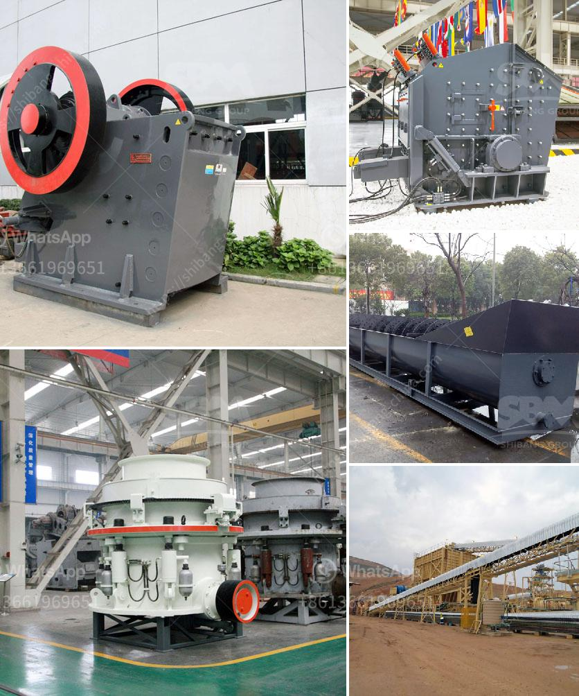

<h3>ball mills in coimbatore</h3>
Ball mills are an integral part of the construction manufacturing industry in Coimbatore. They are considered to be the paradigm of perfection for milling operations. The ball mill is diligently designed for extremely fine grinding and metallurgy purposes. This highly efficient machine is a remnant of scientific and technological advancements of the past.

It is a versatile machine that has evolved over time with the aim of meeting the diverse needs of industries in Coimbatore. From wet grinding to particle size reduction, the ball mill fulfills various duties, including a primary or final grinding stage. The grinding chamber ensures thorough mixing and homogenization of the materials, resulting in improved product quality.

In Coimbatore, the ball mill manufacturers, commonly use the non-ferrous metal ball mill jars for grinding raw materials. Due to the use of premium quality materials and innovative techniques, the ball mills can grind materials into fine powder quickly and efficiently. The ball mill in Coimbatore, in particular, is highly demanded because of its ease of operation, high productivity, and low maintenance requirements.

Manufacturers in Coimbatore strive to offer a diversified range of products that cater to different segments of the market. They are constantly making efforts to improve the performance of their ball mills, incorporating cutting-edge technologies. Renowned manufacturers prioritize delivering a seamless experience to their customers by offering customized solutions that meet their specific requirements.

Furthermore, the ball mills in Coimbatore are also available in a variety of sizes and capacities, providing ample choices for industries with different production volumes. The versatility of these machines enables businesses in Coimbatore to achieve optimal efficiency and productivity while minimizing costs.

In conclusion, ball mills in Coimbatore are a testament to the advancements in technology and the excellence achieved by manufacturers in the construction manufacturing industry. These machines play a crucial role in the processing of various materials, ensuring enhanced product quality and improved performance. With the continuous efforts of manufacturers to innovate and improve their offerings, ball mills in Coimbatore are set to revolutionize the manufacturing sector even further.
<h3>Contact us</h3><ul><li><strong>Whatsapp:&nbsp;<a href="https://wa.me/8613661969651">+8613661969651</a></strong></li><li><a href="https://swt.shibang-china.com/?git&amp;zhl&amp;ball mills in coimbatore"><strong>Online Service(chat now)</strong></a></li></ul><h3>Related</h3><ul><li><a href='stone crusher plant manufacturer.md'>stone crusher plant manufacturer</a></li><li><a href='jaw crusher saudi small capacity.md'>jaw crusher saudi small capacity</a></li><li><a href='small mobile limestone crushers.md'>small mobile limestone crushers</a></li><li><a href='vibrating classifiing screen.md'>vibrating classifiing screen</a></li><li><a href='mines de cobalt de cuivre de la zambie.md'>mines de cobalt de cuivre de la zambie</a></li></ul>