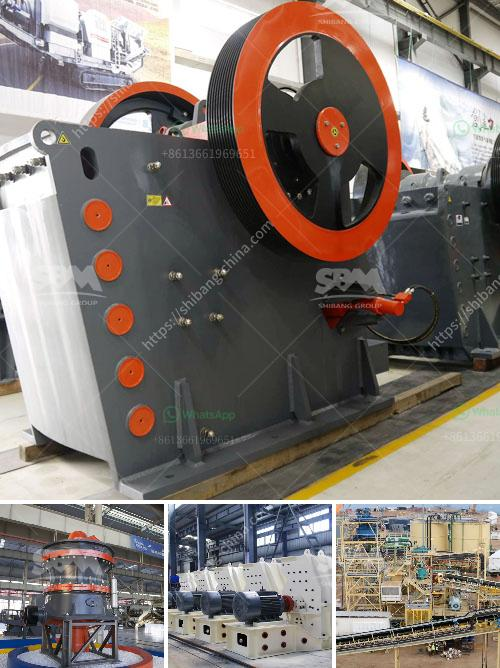

<h3>ball mills in limpets</h3>
Ball mills are a common and essential piece of equipment used in various industries for grinding materials into fine powders. They are renowned for their versatility and ability to grind a wide range of materials, from minerals to chemicals. However, in certain applications where contamination and efficient grinding are of utmost importance, using ball mills in limpets can be the perfect solution.

Limpets, also known as limpet-like sealed vessels or limpet reactors, refer to a hermetically sealed chamber that is specially designed to prevent external contamination during the grinding process. This unique configuration ensures that there is no cross-contamination between batches, making it ideal for applications where purity is critical.

One of the key benefits of using ball mills in limpets is the ability to avoid the introduction of impurities or foreign particles into the material being ground. In industries such as pharmaceuticals, cosmetics, and food processing, maintaining a high level of purity in the final product is crucial. The use of limpets ensures that the material is protected from any potential contamination, resulting in a pure and high-quality end product.

Another advantage of employing ball mills in limpets is their ability to achieve efficient grinding. The sealed chamber of the limpet reactor promotes a controlled and confined environment, allowing for better control of the grinding process. This results in improved energy efficiency and reduced grinding time, ultimately leading to higher productivity.

In addition to the benefits mentioned above, the use of ball mills in limpets also offers a safer working environment. The sealed nature of the limpet reactor prevents any hazardous substances or particles from escaping, ensuring the safety of the operators. This is particularly important when handling toxic or volatile materials that could pose a risk to human health.

Furthermore, ball mills in limpets can also be customized to meet specific requirements. The limpet reactors are available in various sizes and configurations, enabling operators to choose the most suitable option based on the desired capacity, particle size, and other process parameters. This allows for greater flexibility in adapting the equipment to specific applications, resulting in optimized grinding performance.

In conclusion, ball mills in limpets offer a winning combination for efficient grinding and contamination-free processing. The sealed chamber of the limpet reactor prevents any external impurities from contaminating the product, ensuring a high level of purity. Moreover, the controlled environment inside the limpet reactor allows for efficient grinding, leading to improved productivity. Additionally, the use of limpets enhances workplace safety by containing any hazardous substances. Lastly, the versatility and customization options of ball mills in limpets make them an excellent choice for a wide range of applications.

Whether in the pharmaceutical, chemical, or food industry, the utilization of ball mills in limpets provides an essential tool for achieving high-quality, pure, and efficient grinding. With their numerous advantages, ball mills in limpets are paving the way for improved processing capabilities in various industries, revolutionizing the way materials are ground and refined.
<h3>Contact us</h3><ul><li><strong>Whatsapp:&nbsp;<a href="https://wa.me/8613661969651">+8613661969651</a></strong></li><li><a href="https://swt.shibang-china.com/?git&amp;zhl&amp;ball mills in limpets"><strong>Online Service(chat now)</strong></a></li></ul><h3>Related</h3><ul><li><a href='cement grinding mill pdf.md'>cement grinding mill pdf</a></li><li><a href='gold crusher cost.md'>gold crusher cost</a></li><li><a href='hammer mill supplers in bulawayo.md'>hammer mill supplers in bulawayo</a></li><li><a href='how vertical roller mill works.md'>how vertical roller mill works</a></li><li><a href='used washing gold plants for sale in europe.md'>used washing gold plants for sale in europe</a></li></ul>