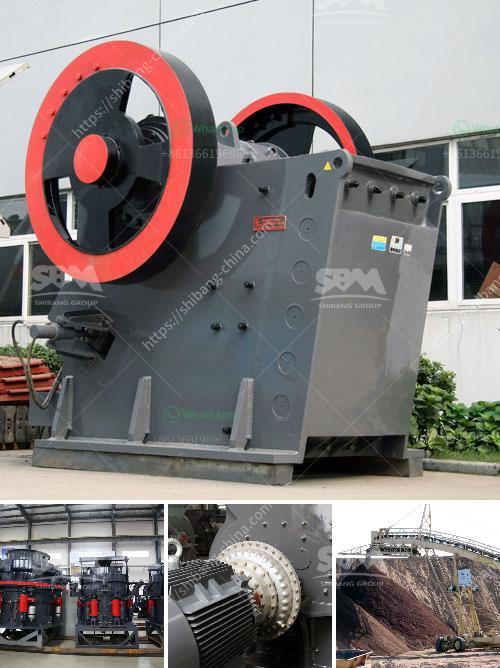

<h3>ball mills nigeria</h3>
Nigeria is richly endowed with large deposits of various solid minerals, including precious metals, stones, and industrial minerals. Today, Nigeria is the largest producer of cement in Sub-Saharan Africa and the 10th largest in the world, employing more than 5,000 workers directly or indirectly. The manufacturing sector plays a crucial role in the country's economic development, and ball mills are an integral part of this sector.

Ball mills are cylindrical devices used to grind materials such as minerals, ores, and chemicals into a fine powder. They are widely used in various industries, including mining, construction, chemical, metallurgical, ceramics, and more. Ball mills work by rotating around a horizontal axis and allowing the grinding media (balls) to cascade, impacting and grinding the materials inside the mill.

Notable ball mill manufacturers in Nigeria include MBS, FLSmidth, Dangote, and more. These companies have invested heavily in the manufacturing and production of ball mills, contributing significantly to the economy of the country. Several factors have made ball mills popular in Nigeria.

Firstly, ball mills are versatile and can easily grind a wide range of materials, including limestone, clinker, coal, and minerals. This versatility makes them suitable for various industries and applications. For example, in the cement industry, ball mills are used to grind the clinker into powder, which is then mixed with other materials to produce cement.

Secondly, ball mills are energy efficient. They consume less power than other grinding mills, thereby reducing energy costs. This is particularly important in Nigeria, where power supply is often unreliable and expensive. Energy-efficient ball mills contribute to reducing the overall operational costs for industries.

Thirdly, ball mills are easy to operate and maintain. They require minimal supervision and maintenance, making them suitable for small and medium-scale industries. In Nigeria, where many businesses operate on a small scale, easy-to-operate equipment is highly valued.

Another advantage of ball mills is their scalability. They can be easily adjusted to meet the production requirements of various industries. From small-scale operations to large-scale industrial applications, ball mills can be customized to process different quantities of materials.

In conclusion, ball mills play a significant role in Nigeria's manufacturing sector. They are versatile, energy-efficient, easy to operate and maintain, and scalable, making them highly sought after by industries. The manufacturing of ball mills in Nigeria has contributed to the growth of the economy while also meeting the needs of various industries. As the country continues to develop, the demand for ball mills is expected to increase, further driving the growth of Nigeria's manufacturing sector.
<h3>Contact us</h3><ul><li><strong>Whatsapp:&nbsp;<a href="https://wa.me/8613661969651">+8613661969651</a></strong></li><li><a href="https://swt.shibang-china.com/?git&amp;zhl&amp;ball mills nigeria"><strong>Online Service(chat now)</strong></a></li></ul><h3>Related</h3><ul><li><a href='prices of harmer mills in south africa.md'>prices of harmer mills in south africa</a></li><li><a href='production rate limestone crusher.md'>production rate limestone crusher</a></li><li><a href='arriendo de chancadores chile.md'>arriendo de chancadores chile</a></li><li><a href='grinder machine for fine powder.md'>grinder machine for fine powder</a></li><li><a href='rock sand machinery india.md'>rock sand machinery india</a></li></ul>