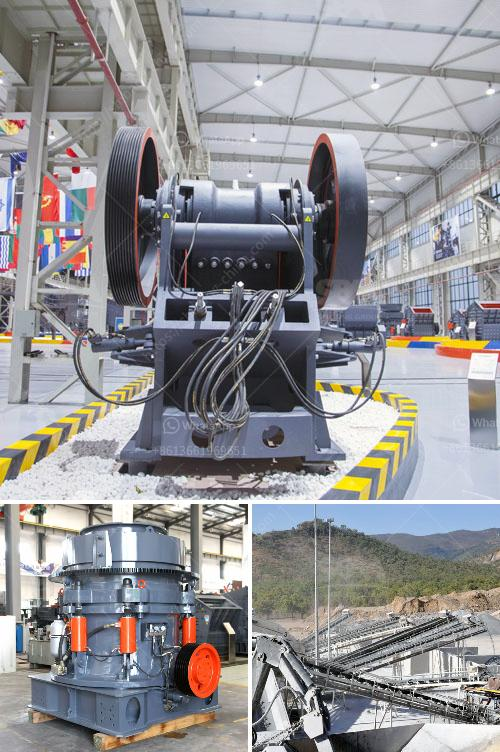

<h3>ballast crusher plant</h3>
Ballast, commonly referred to as railroad ballast, is a crucial component in railway track infrastructure. Supporting the railway sleepers and facilitating drainage, ballast plays a significant role in maintaining the stability and reliability of the tracks.

A ballast crusher plant, designed specifically for the disposal of waste ballast material, enables sustainable recycling and promotes environmental responsibility. The cone crusher, widely used in secondary and tertiary crushing, is recognized as an ideal choice in the production of ballast aggregates, capable of producing up to 1,000 tons per hour.

A well-designed ballast crusher plant can greatly contribute to the output and quality of the final ballast products, thus prolonging the ballast service life and reducing the maintenance costs of the railway tracks. This is achieved through selective crushing of the materials and consistent particle size distribution during the crushing process.

Moreover, the modern ballast crusher plant is equipped with advanced electrical control operating system, which greatly improves its automation degree. An efficient and intelligent process control leads to enhanced productivity and reduced operating costs.

In addition to its primary function of producing ballast aggregates, the ballast crusher plant can also provide a valuable source of secondary materials, such as sand, gravel, and recycled asphalt. These materials can be further utilized in various construction projects, minimizing the need for virgin materials and reducing the environmental impact associated with their extraction.

1. Environmentally friendly: Recycling waste ballast materials reduces the demand for virgin materials and minimizes the accumulation of landfill waste.

2. Cost-effective: By producing high-quality ballast aggregates, maintenance costs of the railway tracks are reduced, resulting in long-term cost savings.

3. Versatile usage: Besides ballast production, the plant can generate secondary materials that can be utilized in other construction applications.

4. Sustainability: Through the efficient use of resources and recycling, the plant contributes to sustainable development and circular economy initiatives.

In conclusion, a ballast crusher plant brings numerous benefits to railway track infrastructure. Its ability to recycle waste ballast materials, actively contribute to environmental sustainability, and lower costs, makes it an essential tool for fostering efficient railway operations and responsible construction practices.
<h3>Contact us</h3><ul><li><strong>Whatsapp:&nbsp;<a href="https://wa.me/8613661969651">+8613661969651</a></strong></li><li><a href="https://swt.shibang-china.com/?git&amp;zhl&amp;ballast crusher plant"><strong>Online Service(chat now)</strong></a></li></ul><h3>Related</h3><ul><li><a href='clinker grinding mill germany price.md'>clinker grinding mill germany price</a></li><li><a href='feasibility study for gypsum processing plant pdf.md'>feasibility study for gypsum processing plant pdf</a></li><li><a href='limestone grinding system.md'>limestone grinding system</a></li><li><a href='small mining equipment price in south africa.md'>small mining equipment price in south africa</a></li><li><a href='gypsum router machines in uae.md'>gypsum router machines in uae</a></li></ul>