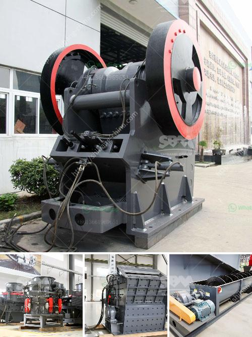

<h3>ballast crushing machines in nairobi</h3>
Ballast crushing refers to the process of breaking down stone into small pieces or particles that are used in construction for creating a stable foundation for large areas such as roads, railways, and buildings. Ballast crushing machines in Nairobi have gained widespread popularity in the mining industry, mainly due to their ability to crush large stones into various sizes for different construction applications.

The crushing process involves multiple stages, such as initial crushing, secondary crushing, and fine crushing. Different machines are used at each stage to ensure the desired size and quality of the final product. These machines are designed to be efficient and reliable, reducing the overall cost of the construction project.

One of the key components used in crushing machines is the conveyor belt, which transports the materials from one stage to another. This eliminates the need for manual labor and simplifies the process. The conveyor belt can be adjusted to control the speed and direction of the materials, allowing for quick and precise crushing.

Another essential component is the vibrating screen, which separates the crushed materials into different sizes. The vibrating screen ensures that only the desired particles pass through, while any larger pieces are sent back for further crushing. This process helps to achieve uniformity in the final product, resulting in better quality construction materials.

Several types of ballast crushing machines are used in the market today, including jaw crushers, impact crushers, and cone crushers. These machines employ different crushing principles and are driven by electric or diesel engines. Some machines are even hybrid, combining electricity and diesel power for greater efficiency.

In Nairobi, there are many suppliers and manufacturers of ballast crushing machines, who offer various machines with different specifications and features. It is essential for buyers to conduct thorough research and choose a machine that best suits their specific requirements. Factors such as production capacity, power consumption, and durability should be considered while making a decision.

When purchasing a ballast crushing machine, it is crucial to also consider the after-sales services provided by the manufacturer or supplier. This includes warranty, spare parts availability, and technical support. A reliable supplier will not only deliver a high-quality machine but also ensure that it continues to perform optimally throughout its lifespan.

Additionally, it is important to consider the cost-effectiveness of the machine. While the initial investment might be significant, a machine that offers lower operational and maintenance costs can prove to be financially beneficial in the long run.

In conclusion, ballast crushing machines in Nairobi play a crucial role in construction by breaking down large stones into various sizes suitable for different applications. The availability of different types of machines allows buyers to choose the most suitable one for their specific needs. Careful consideration of factors such as machine specifications, after-sales services, and cost-effectiveness is essential for making an informed purchasing decision. With the right machine, construction projects can be completed efficiently and cost-effectively, ensuring long-lasting and stable foundations.
<h3>Contact us</h3><ul><li><strong>Whatsapp:&nbsp;<a href="https://wa.me/8613661969651">+8613661969651</a></strong></li><li><a href="https://swt.shibang-china.com/?git&amp;zhl&amp;ballast crushing machines in nairobi"><strong>Online Service(chat now)</strong></a></li></ul><h3>Related</h3><ul><li><a href='vibrating screen efficiency.md'>vibrating screen efficiency</a></li><li><a href='crusher plant saudi.md'>crusher plant saudi</a></li><li><a href='kaolin processing plant.md'>kaolin processing plant</a></li><li><a href='gold crushing machine.md'>gold crushing machine</a></li><li><a href='dolomite rock crusher.md'>dolomite rock crusher</a></li></ul>