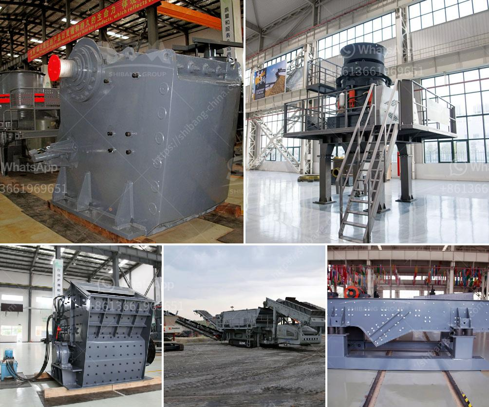

<h3>ballast making machine kenya</h3>
The construction industry in Kenya is growing at a rapid pace. As a result, there is a high demand for ballast, which is a crucial material used in the construction of roads, railways, and buildings. Ballast making machines are essential for producing high-quality ballast for construction purposes. This article will focus on the ballast making machine in Kenya.

In the ballast making machine, stones are crushed to produce ballast that is used to pave and construct roads. The machine is capable of crushing different sizes and quantities of rocks. The machine is environmentally friendly and features minimal dust emission, which makes it safe to use, especially in residential areas.

One of the leading ballast making machine in Kenya manufacturers is Camelway Machinery. Camelway has a team of highly skilled engineers working to ensure that their machines are of the highest quality. Their ballast making machines have been in use in various parts of Kenya, helping to facilitate the construction of critical infrastructure projects.

The ballast making machine is easy to operate, and its output capacity can be adjusted depending on the material being crushed. It has a production rate of up to 500 tons per hour, making it an excellent machine for large-scale projects. The machine is also versatile and can be used to produce different grades of ballast material.

There are various types of ballast making machines in the market, ranging from jaw crushers to impact crushers and cone crushers. Each type has its unique features and advantages. Jaw crushers are known for their durability and high crushing capacity. They are suitable for crushing hard and tough materials. Impact crushers, on the other hand, are ideal for crushing soft and medium-hard rocks. They produce a more cubical-shaped aggregate compared to jaw crushers. Cone crushers are compact and efficient, making them popular for secondary and tertiary crushing.

The cost of ballast making machines depends on several factors, including the brand, size, and production capacity. The price ranges from tens of thousands to hundreds of thousands of dollars. However, the long-term benefits outweigh the initial investment cost. By producing their ballast using a ballast making machine, construction companies in Kenya can reduce the overall cost of their projects while ensuring the quality of the material.

Aside from the economic advantages, using a ballast making machine improves the efficiency of construction projects. The machine enables contractors to produce ballast on-site, eliminating the need to transport bulk materials over long distances. This, in turn, reduces transportation costs and minimizes the carbon footprint associated with construction activities.

In conclusion, the ballast making machine is a crucial piece of equipment that plays a significant role in the construction industry in Kenya. It enables the production of high-quality ballast, facilitating the construction of roads, railways, and buildings. The machine is versatile, eco-friendly, and cost-effective, making it an excellent investment for construction companies in Kenya. With a wide range of options available, contractors can choose the right ballast making machine that meets their specific requirements.
<h3>Contact us</h3><ul><li><strong>Whatsapp:&nbsp;<a href="https://wa.me/8613661969651">+8613661969651</a></strong></li><li><a href="https://swt.shibang-china.com/?git&amp;zhl&amp;ballast making machine kenya"><strong>Online Service(chat now)</strong></a></li></ul><h3>Related</h3><ul><li><a href='gypsum crushing machine.md'>gypsum crushing machine</a></li><li><a href='how to control partials size in vertical hammer mill.md'>how to control partials size in vertical hammer mill</a></li><li><a href='quartz grinding ball mill sizes list.md'>quartz grinding ball mill sizes list</a></li><li><a href='iron ore beneficiation plant suppliers.md'>iron ore beneficiation plant suppliers</a></li><li><a href='300tph ball mill manufacturer in philippines.md'>300tph ball mill manufacturer in philippines</a></li></ul>