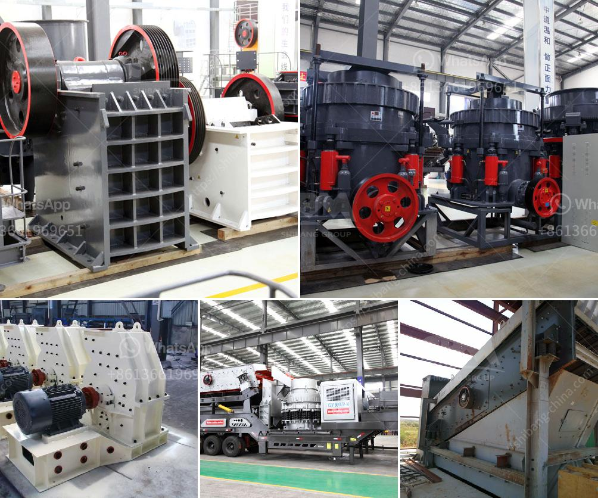

<h3>balls level in ball mill</h3>
The ball mill, initially used as a grinding device in the mining industry, is suited for fine grinding of materials. It has been the standard equipment in factories that require the grinding and dispersion of liquid or solid materials for many years. However, ball mills may require constant optimization, especially regarding the grinding balls' level inside the vessel.

The power draw of the ball mill is directly linked to the mass of balls within the mill. In order to maintain the desired power draw, the weight of these balls must be replenished accordingly. As the grinding progresses, the balls wear out and lose mass, which decreases their efficiency and grinding capabilities. Consequently, it is crucial to monitor and adjust the ball level within the mill to optimize grinding efficiency and maintain consistent power draw.

To achieve this, operators need to regularly check the level of grinding balls within the mill. This can be done using various methods, such as visually inspecting the mill's interior, taking measurements with a sound or vibration analyzer, or using an automated system that continuously monitors the ball level.

Traditionally, operators visually inspect ball mills to determine the level of grinding balls. While this method is straightforward, it can be time-consuming and prone to human errors. Moreover, it does not provide real-time information on the ball level, which makes it challenging to make adjustments in a timely manner.

Alternatively, sound or vibration analyzers can be used to monitor the ball level. These devices measure the frequency and amplitude changes caused by the grinding balls' impact with the mill's interior. Based on these measurements, operators can estimate the ball level and make necessary adjustments. However, this method requires specialized equipment and expertise to interpret the data accurately.

Furthermore, automated ball level monitoring systems have become more prevalent in modern ball mills. These systems use sensors placed inside the mill to measure the ball level continuously. The collected data is then analyzed and displayed in real-time, allowing operators to track the ball level and make immediate adjustments if required. This eliminates the need for manual inspection and reduces the risk of human errors.

Maintaining an optimal ball level in the mill is essential for efficient grinding operations. A high ball level leads to excessive impaction, where the balls collide against each other and the mill's interior, causing unnecessary wear and reducing grinding efficiency. On the other hand, a low ball level results in decreased grinding performance, as there are not enough balls to generate sufficient impact.

To determine the ideal ball level, various factors should be considered. These include the mill's type and size, the desired fineness of the ground product, the grinding media's characteristics, and the material being processed. Experimentation and continuous adjustment are often necessary to find the optimal ball level for a specific application.

In conclusion, maintaining an appropriate ball level in the ball mill is crucial for efficient grinding and mill performance. Operators should regularly monitor the ball level to ensure it remains within the desired range. Visual inspection, sound or vibration analysis, and automated ball level monitoring systems are all effective methods for monitoring and adjusting the ball level. By optimizing the ball level, factories can achieve higher grinding efficiency, reduce downtime, and improve overall productivity.
<h3>Contact us</h3><ul><li><strong>Whatsapp:&nbsp;<a href="https://wa.me/8613661969651">+8613661969651</a></strong></li><li><a href="https://swt.shibang-china.com/?git&amp;zhl&amp;balls level in ball mill"><strong>Online Service(chat now)</strong></a></li></ul><h3>Related</h3><ul><li><a href='plamnta mobile stone crusher.md'>plamnta mobile stone crusher</a></li><li><a href='copper concentrate processing equipment.md'>copper concentrate processing equipment</a></li><li><a href='pioneer ve rock crusher.md'>pioneer ve rock crusher</a></li><li><a href='mineral processing plants china.md'>mineral processing plants china</a></li><li><a href='barite grinding companies.md'>barite grinding companies</a></li></ul>