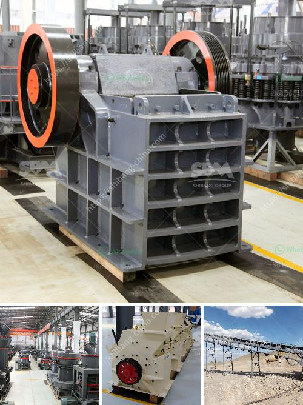

<h3>bando rubber conveyor belt pdf</h3>
The Bando rubber conveyor belt has been an invaluable tool in various industries for decades. Its high tensile strength, durability, and flexibility make it a top choice for conveyor systems across the globe. The Bando rubber conveyor belt PDF is a comprehensive guide that provides all the necessary information about this remarkable product.

One of the most significant advantages of the Bando rubber conveyor belt is its superior wear resistance. It is designed to endure rigorous conditions and can withstand heavy loads for an extended period. This makes it ideal for industries such as mining, construction, and manufacturing, where materials need to be transported continuously. The Bando rubber conveyor belt PDF explains the unique manufacturing process that incorporates high-quality rubber compounds to ensure maximum durability.

Moreover, the PDF highlights the exceptional thermal resistance of the Bando rubber conveyor belt. It can operate seamlessly in extreme temperatures, ranging from freezing cold to scorching heat, without compromising its performance. This is particularly beneficial for industries that operate in harsh environments or deal with hot materials, such as foundries and cement factories.

Furthermore, the Bando rubber conveyor belt PDF addresses the importance of proper maintenance and installation. It offers detailed guidelines and instructions to ensure that the conveyor belt is installed correctly and regularly maintained to prolong its lifespan. This information can help companies reduce downtime and enhance productivity by avoiding unexpected breakdowns and unnecessary repairs.

In conclusion, the Bando rubber conveyor belt PDF is an invaluable resource for anyone working with conveyor systems. Its comprehensive information and practical guidelines make it a go-to guide for engineers, technicians, and maintenance personnel. The robust construction, superior wear resistance, thermal resistance, and optimal performance of the Bando rubber conveyor belt have made it a trusted choice for various industries worldwide.
<h3>Contact us</h3><ul><li><strong>Whatsapp:&nbsp;<a href="https://wa.me/8613661969651">+8613661969651</a></strong></li><li><a href="https://swt.shibang-china.com/?git&amp;zhl&amp;bando rubber conveyor belt pdf"><strong>Online Service(chat now)</strong></a></li></ul><h3>Related</h3><ul><li><a href='dolomite grinding machine.md'>dolomite grinding machine</a></li><li><a href='consultants to help to start a stone crusher.md'>consultants to help to start a stone crusher</a></li><li><a href='stone crusher machine malaysia.md'>stone crusher machine malaysia</a></li><li><a href='cheat gold crusher.md'>cheat gold crusher</a></li><li><a href='small rock crusher for sale.md'>small rock crusher for sale</a></li></ul>