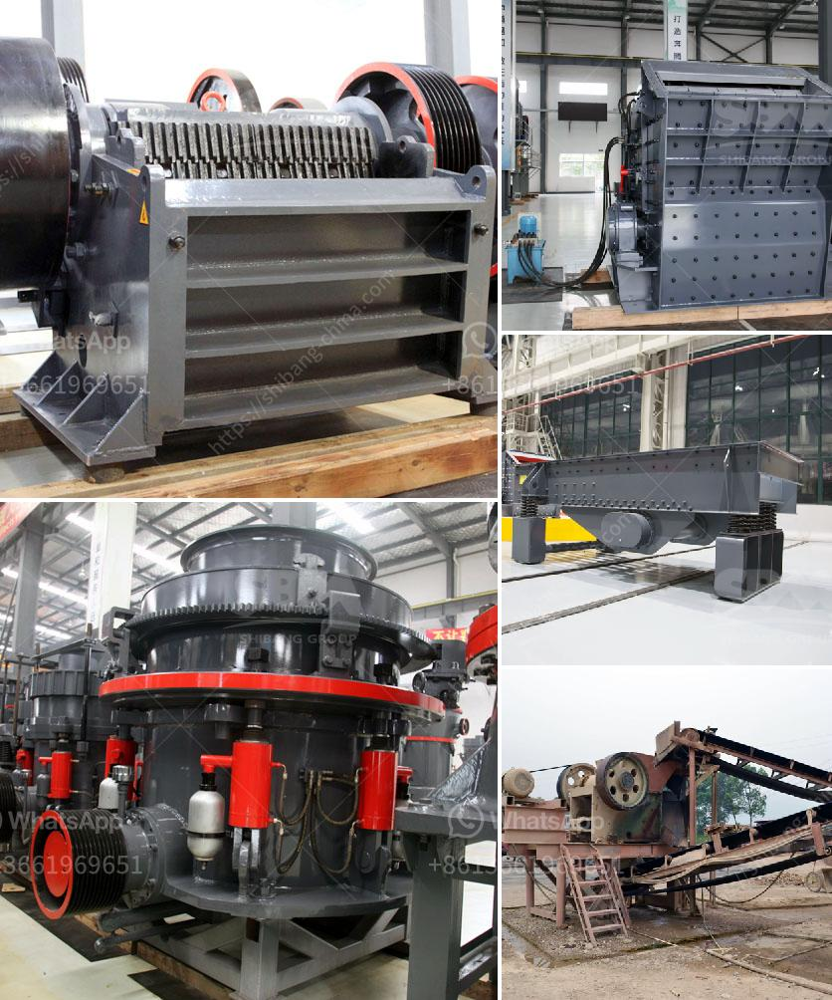

<h3>barite grinding companies</h3>
Barite grinding companies play a crucial role in the mining industry, as they provide the much-needed mineral processing solutions. Barite, also known as baryte, is a barium sulfate mineral, composed of barium sulfate (BaSO4). It is typically found in sedimentary rock formations, including limestone, shale, and clay.

The demand for barite has been steadily increasing due to its diverse applications in various industries. One of the primary uses of barite is as a weighting agent in drilling fluids used in the oil and gas industry. This heavy material helps stabilize the drilling process and prevent blowouts. Additionally, barite is also utilized in the production of various barium compounds, rubber and plastics, paints and coatings, and even in medical imaging procedures.

However, before it can be used in these applications, barite needs to be finely ground to achieve the desired particle size and purity. This is where barite grinding companies come in. These companies employ advanced technologies and equipment to process the raw barite into a finely ground powder.

The process of grinding barite involves crushing the mined ore and then grinding it into a powder. The crushing process reduces the size of the mineral, while grinding further refines it to achieve the desired particle size. These grinding companies utilize mills, such as ball mills and Raymond mills, to crush and grind the barite ore.

To ensure the quality of the final product, many barite grinding companies implement a strict quality control process. This includes conducting regular tests and analysis to monitor the particle size distribution, chemical composition, and overall purity of the barite powder. By maintaining consistent quality, these companies ensure that their customers receive a reliable and high-quality product.

Moreover, barite grinding companies also focus on environmental sustainability in their operations. They ensure that their processes adhere to international environmental regulations and guidelines. This includes minimizing water usage, properly managing waste, and implementing strategies to reduce energy consumption. By adopting sustainable practices, these companies contribute to the overall environmental conservation efforts of the mining industry.

In conclusion, barite grinding companies play a vital role in providing the necessary processing solutions to meet the growing demand for barite in various industries. Their expertise in crushing and grinding raw barite ore ensures that it can be used in applications such as drilling fluids, barium compounds, paints, and coatings, among others. Moreover, their commitment to quality control and environmental sustainability showcases their dedication to delivering reliable and sustainable products. As the demand for barite continues to rise, these grinding companies will continue to be crucial contributors to the successful utilization of this essential mineral.
<h3>Contact us</h3><ul><li><strong>Whatsapp:&nbsp;<a href="https://wa.me/8613661969651">+8613661969651</a></strong></li><li><a href="https://swt.shibang-china.com/?git&amp;zhl&amp;barite grinding companies"><strong>Online Service(chat now)</strong></a></li></ul><h3>Related</h3><ul><li><a href='buy crusher of impact of 10 tph.md'>buy crusher of impact of 10 tph</a></li><li><a href='gold mining equipment manufacturers in china.md'>gold mining equipment manufacturers in china</a></li><li><a href='concrete and stone crushing machines in kenya.md'>concrete and stone crushing machines in kenya</a></li><li><a href='new technology ball mill factories europe.md'>new technology ball mill factories europe</a></li><li><a href='new generation of hammer mill.md'>new generation of hammer mill</a></li></ul>