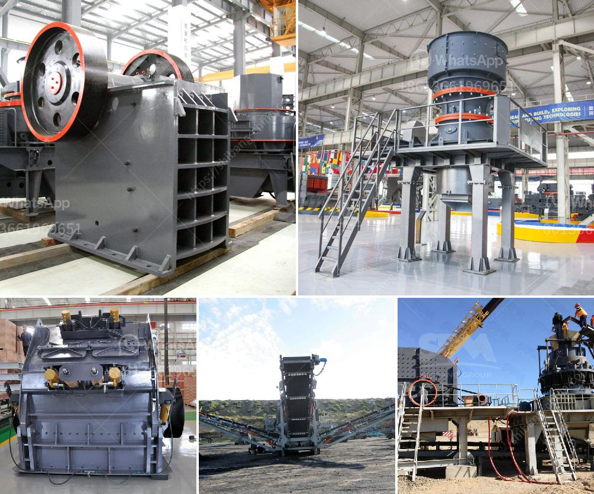

<h3>barite ore processing in morocco</h3>
Barite is a mineral composed of barium sulfate (BaSO4) and is a highly sought-after industrial mineral used in various applications such as drilling fluid, chemical industries, and medical imaging procedures. Morocco is one of the leading producers of barite ore worldwide, with a significant amount of the mineral resources located in the country's Atlas Mountains.

The extraction and processing of barite ore in Morocco plays a vital role in the country's economy and industrial development. The mining industry in Morocco has been growing steadily over the years, attracting both domestic and foreign investments. The barite mining sector in particular has experienced significant growth, thanks to the high demand for the mineral and the country's abundant reserves.

The process of extracting barite ore starts with exploration activities to locate the potential deposits. Geological surveys and studies are conducted to identify the areas with high concentrations of barite. Once the deposits are found, they are usually extracted through open-pit mining methods. The ore is then transported to the surface for further processing.

In Morocco, the ore processing activities mainly consist of crushing, grinding, and screening processes to produce high-quality barite products. These processes are necessary to obtain the desired barite particle size for various applications. After the initial crushing stage, the ore is further reduced in size through grinding mills. This process helps to liberate the barite particles from the gangue minerals and improve the overall quality of the final product.

Once the ore is ground to the desired size, it undergoes a screening process to separate different grades of barite. The screened barite is then packed and transported to various industries for use. In addition to its industrial applications, barite ore is also used in the medical field as a contrast agent in X-ray and CT scans.

Morocco's barite ore processing industry has seen significant advancements in recent years, with modern technology and equipment being employed to improve efficiency and quality. This has allowed the country to meet the growing global demand for barite and increase its production capacity.

The barite mining and processing industry in Morocco also contribute to the local economy through job creation and the generation of export revenues. The sector provides employment opportunities for many local communities, especially in the Atlas Mountains region where the majority of the mining activities take place.

In conclusion, Morocco holds a significant position in the global barite ore processing industry. The country's abundant reserves, coupled with advanced processing techniques and equipment, have allowed it to become a major player in the international market. The barite mining sector in Morocco continues to thrive, supporting economic growth and development in the country. As the demand for barite continues to rise, Morocco is well-positioned to benefit from its rich mineral resources and contribute to the global supply chain.
<h3>Contact us</h3><ul><li><strong>Whatsapp:&nbsp;<a href="https://wa.me/8613661969651">+8613661969651</a></strong></li><li><a href="https://swt.shibang-china.com/?git&amp;zhl&amp;barite ore processing in morocco"><strong>Online Service(chat now)</strong></a></li></ul><h3>Related</h3><ul><li><a href='limestone quarry machines and equipments.md'>limestone quarry machines and equipments</a></li><li><a href='ballast crusher plant.md'>ballast crusher plant</a></li><li><a href='mobile coal cone crusher for hire malaysia.md'>mobile coal cone crusher for hire malaysia</a></li><li><a href='basalt fiber production lines.md'>basalt fiber production lines</a></li><li><a href='ball mill work rules.md'>ball mill work rules</a></li></ul>