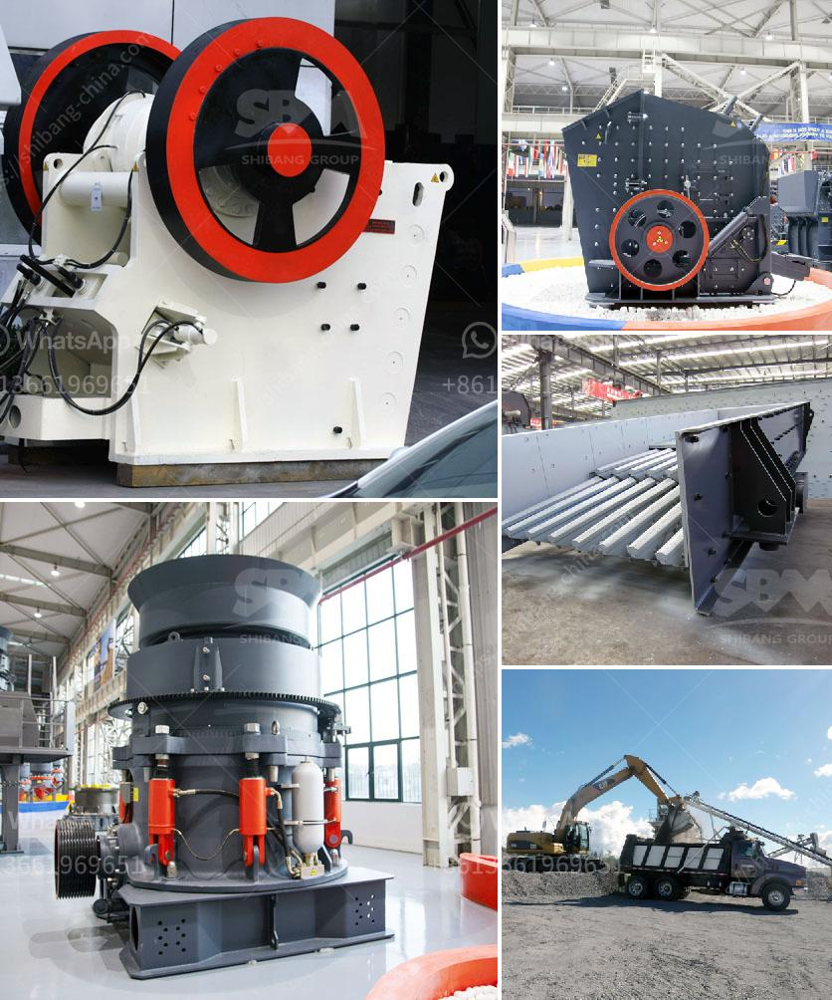

<h3>barite powder machine</h3>
Barite, also known as baryte, is a naturally occurring mineral that is commonly found in many parts of the world. It is typically white or colorless, but can also have shades of blue, yellow, or brown. Barite is mainly composed of barium sulfate and has a wide range of applications across various industries, including oil and gas drilling, paint and coating, rubber, and pharmaceuticals.

As the demand for barite continues to rise, the need for efficient processing machines has become crucial. This is where the barite powder machine comes into play. This powerful tool plays a vital role in the extraction and refining of barite, making it a valuable asset in resource extraction operations.

The barite powder machine is designed to process barite powder into fine and ultrafine powder, making it suitable for a wide range of industrial applications. The machine employs various processing technologies, including crushing, grinding, and pulverizing, to achieve the desired particle size distribution and surface area. These processes are essential for enhancing the properties and performance of barite powder.

One of the key features of the barite powder machine is its ability to produce a high-quality product with consistent particle size distribution. This is accomplished through the use of advanced grinding and classification techniques, such as ball milling and air classification. These processes ensure that the final product meets the specified particle size range, which is crucial for achieving optimal performance in various applications.

The barite powder machine also offers several advantages in terms of energy efficiency and environmental sustainability. Its innovative design optimizes energy consumption and reduces the carbon footprint associated with the processing of barite. The machine utilizes advanced technologies, such as high-efficiency motors and intelligent control systems, to minimize energy consumption while maximizing production output.

Furthermore, the barite powder machine employs state-of-the-art dust collection and filtration systems to minimize the release of particulate matter and other pollutants into the atmosphere. This ensures a clean and safe working environment for operators and mitigates the environmental impact of barite processing operations.

In addition to its resource extraction applications, the barite powder machine also plays a crucial role in promoting economic growth and development. The machine creates job opportunities in the mining and processing sectors, contributing to local employment and income generation. Moreover, the processed barite powder can be exported to various international markets, strengthening the country's foreign exchange reserves and economic stability.

In conclusion, the barite powder machine is a powerful tool that plays a vital role in resource extraction operations. It offers efficient processing capabilities, high-quality product output, energy efficiency, and environmental sustainability. As the demand for barite continues to rise, the need for advanced machines like the barite powder machine will become even more essential in meeting the industry's requirements. With its various benefits and advantages, the barite powder machine is poised to revolutionize the barite processing industry and contribute to economic growth and development.
<h3>Contact us</h3><ul><li><strong>Whatsapp:&nbsp;<a href="https://wa.me/8613661969651">+8613661969651</a></strong></li><li><a href="https://swt.shibang-china.com/?git&amp;zhl&amp;barite powder machine"><strong>Online Service(chat now)</strong></a></li></ul><h3>Related</h3><ul><li><a href='used machines philippines ball mill.md'>used machines philippines ball mill</a></li><li><a href='second hand stone crushing plants india.md'>second hand stone crushing plants india</a></li><li><a href='new technology stone crusher in india.md'>new technology stone crusher in india</a></li><li><a href='old cement plant in india for sale.md'>old cement plant in india for sale</a></li><li><a href='technology of conveyor belts.md'>technology of conveyor belts</a></li></ul>