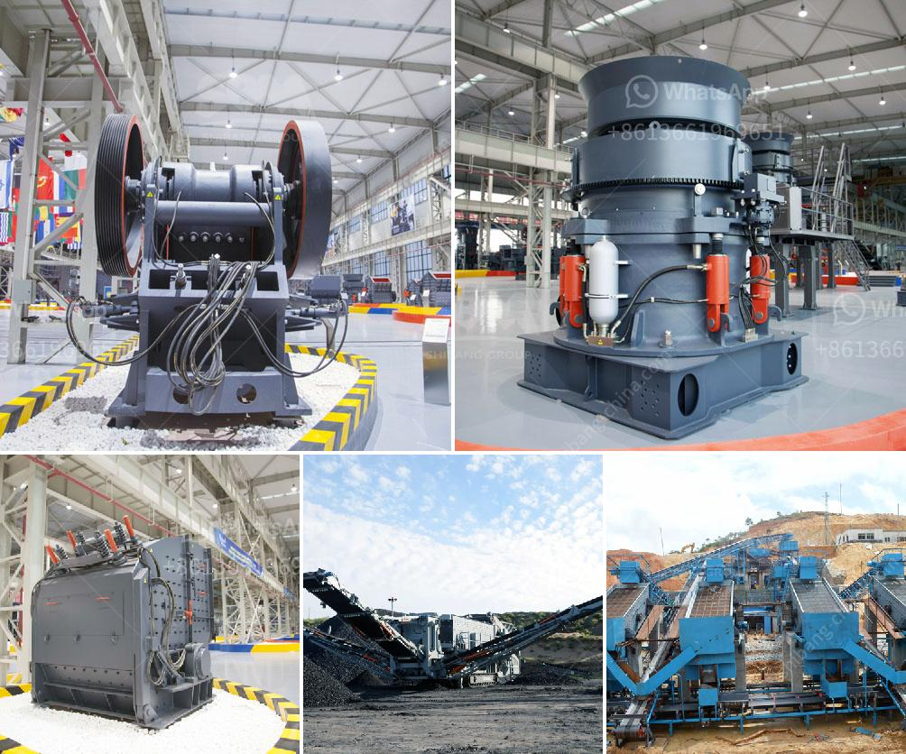

<h3>barite processing plant feasibility study</h3>
Barite is a mineral composed of barium sulfate (BaSO4), typically found in dense cluster form. It is a non-metallic mineral, and its high specific gravity makes it ideal for a wide range of industrial, medical, and manufacturing uses. Due to its importance in various industries, the establishment of a barite processing plant has become a topic of interest for entrepreneurs and investors.

A feasibility study is an essential step in assessing the viability of any project, including the establishment of a barite processing plant. This study aims to evaluate the potential profitability, technical requirements, and environmental impact of the proposed plant.

One of the primary factors in determining the feasibility of a barite processing plant is the market demand. Barite is widely used in the oil and gas industry as a drilling fluid additive due to its high specific gravity and chemical stability. Therefore, analyzing the current and future market demand for barite is crucial in estimating the plant's potential profitability.

To conduct a feasibility study, a comprehensive market analysis should be carried out to determine the supply and demand dynamics. This analysis should include an assessment of the global and regional demand for barite, key market players, and potential competition. Additionally, the study should encompass the pricing trends and any regulatory factors that may affect the market.

Another critical aspect of a feasibility study is the assessment of the technical requirements for establishing a barite processing plant. This includes identifying suitable locations for the plant, determining the required infrastructure, and evaluating the necessary machinery and equipment.

The location of the plant should be strategically chosen, considering factors such as proximity to barite mines, transportation costs, and availability of skilled labor. Furthermore, the study should determine the technological processes required to extract, process, and purify barite to meet the industry standards.

Moreover, environmental considerations play a significant role in the feasibility study. Operators must ensure that the plant's operations comply with environmental regulations and engage in sustainable practices. This includes evaluating the potential impact on surrounding ecosystems, water sources, and air quality.

The feasibility study should also include an assessment of the financial viability of the project. It should estimate the initial investment required to establish the plant, including land acquisition, infrastructure development, and machinery purchase. Additionally, the study should evaluate the operating costs, expected revenues, and potential returns on investment.

The conclusion of a barite processing plant feasibility study is typically a detailed report that outlines the overall findings and recommendations. It provides valuable insights to potential investors and stakeholders, enabling them to make informed decisions about the project.

In conclusion, conducting a feasibility study for a barite processing plant is crucial to determine its viability and potential profitability. It involves analyzing the market demand, evaluating the technical requirements, considering environmental factors, and assessing the financial aspects. A well-executed feasibility study helps stakeholders gain a deeper understanding of the project's feasibility and guides them towards making informed investment decisions.
<h3>Contact us</h3><ul><li><strong>Whatsapp:&nbsp;<a href="https://wa.me/8613661969651">+8613661969651</a></strong></li><li><a href="https://swt.shibang-china.com/?git&amp;zhl&amp;barite processing plant feasibility study"><strong>Online Service(chat now)</strong></a></li></ul><h3>Related</h3><ul><li><a href='how much is scm series ultrafine mill machine in usa.md'>how much is scm series ultrafine mill machine in usa</a></li><li><a href='ball mill machine price in india.md'>ball mill machine price in india</a></li><li><a href='coal wash plant indonesia.md'>coal wash plant indonesia</a></li><li><a href='cost of a mill of hammers.md'>cost of a mill of hammers</a></li><li><a href='stone crushing industry tanzania.md'>stone crushing industry tanzania</a></li></ul>