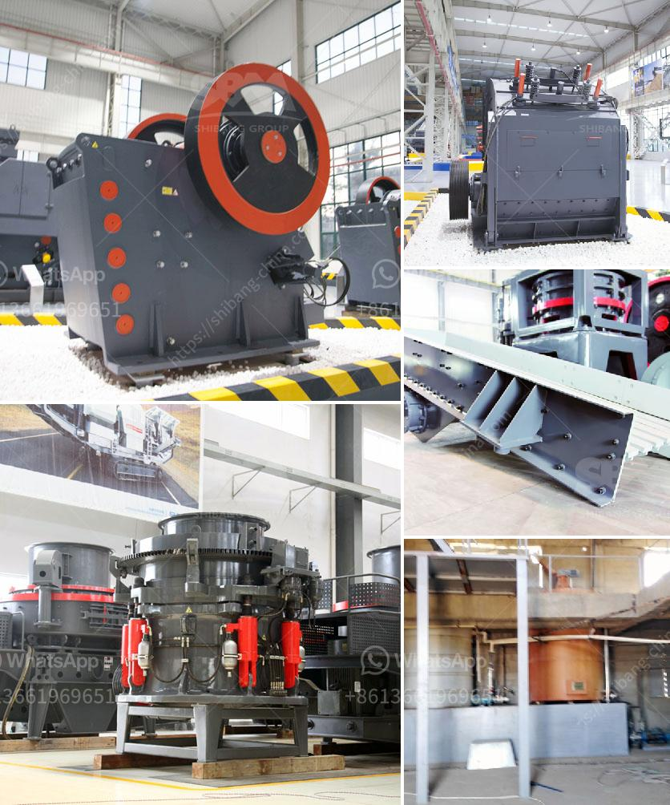

<h3>basalt beneficiation process</h3>
Basalt is a common extrusive volcanic rock that is formed from the rapid cooling of basaltic lava. It is found in abundance on Earth's surface, making it one of the most common rock types in the world. Basalt has many industrial uses due to its excellent durability, high strength, and resistance to weathering. However, before it can be used in various applications, basalt must undergo a beneficiation process.

Basalt beneficiation aims to remove impurities and improve the quality of the rock for specific industrial applications. The process typically involves crushing, grinding, magnetic separation, and froth flotation. These processes work together to effectively separate the desired minerals and remove unwanted substances.

Firstly, the basalt is crushed into smaller pieces to facilitate further processing. This is usually done using jaw crushers or impact crushers. The crushed basalt is then ground into a fine powder using ball mills or vertical roller mills. This grinding process helps to expose the minerals and increase their surface area for subsequent beneficiation.

Magnetic separation is a key step in the basalt beneficiation process. It involves using magnets to separate the magnetic minerals from non-magnetic ones. This is particularly useful for removing iron and other metallic impurities from the basalt, which can affect its quality and performance.

Froth flotation is another important step in basalt beneficiation. This process uses chemicals and air bubbles to selectively separate the desired minerals from the unwanted ones. By adjusting the chemical composition and pH of the flotation solution, specific minerals can be effectively separated and concentrated.

After undergoing the beneficiation process, the high-quality basalt can be used in various industrial applications. It is commonly used as a construction material, in the production of concrete, asphalt, and road aggregates. Basalt fiber, which is derived from basalt rocks, is also used as a reinforcement material in the construction industry.

In conclusion, the beneficiation process plays a crucial role in improving the quality and usability of basalt. By removing impurities and separating desired minerals, it ensures that the basalt meets the requirements for its intended industrial applications. This process not only enhances the value of basalt but also contributes to the overall sustainability and efficiency of various industries.
<h3>Contact us</h3><ul><li><strong>Whatsapp:&nbsp;<a href="https://wa.me/8613661969651">+8613661969651</a></strong></li><li><a href="https://swt.shibang-china.com/?git&amp;zhl&amp;basalt beneficiation process"><strong>Online Service(chat now)</strong></a></li></ul><h3>Related</h3><ul><li><a href='slag crusher plant india.md'>slag crusher plant india</a></li><li><a href='roller mill grinding roller.md'>roller mill grinding roller</a></li><li><a href='bauxite mining process flow chart germany.md'>bauxite mining process flow chart germany</a></li><li><a href='used silica sand washing plant for sale.md'>used silica sand washing plant for sale</a></li><li><a href='concrete crusher cost.md'>concrete crusher cost</a></li></ul>