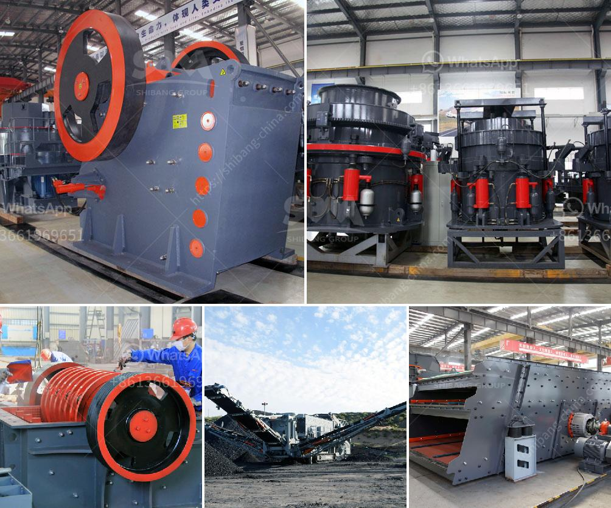

<h3>basalt crusher plant price</h3>
The demand for basalt raw materials has been soaring in recent years, due to the continuous growth of construction industry. As a result, there is a great need for basalt crusher plants, especially in urban areas or near the construction sites. To meet the demands of the customers, Fote Heavy Machinery has developed various basalt crushing plants with different specifications and models.

Basalt is a good material for repairing roads, railways and airport runways. It has the advantages of strong pressure resistance, low crushing value, strong corrosion resistance, and asphalt adhesion. Basalt crusher is mainly used for crushing basalt, granite, bauxite and other materials. It is widely used in mining, construction, metallurgy and other industries.

Under the continuous improvement and innovation of Fote Heavy Machinery, the basalt crusher has greatly changed in the past few years. The basalt crushing process can be divided into three stages: coarse crushing, medium crushing, and fine crushing. Different crushing equipment can be selected according to different crushing needs.

In addition to providing various types of basalt crusher machines, Fote Machinery also offers various rock crushing solutions, such as basalt jaw crusher, basalt impact crusher, basalt cone crusher, basalt roller crusher, etc. For the vast majority of customers, the price of basalt crushing equipment is an important factor to consider when purchasing equipment. In general, users should choose a relatively low-priced basalt crusher machine, that is not only affordable but also has good quality.

Fote Heavy Machinery is a professional manufacturer and supplier of basalt crushing equipment. It has established a good customer reputation in the local area and has a strong cost-effective advantage. Therefore, customers can consult and select the appropriate model for the specific production requirements, and then customize the appropriate basalt crusher plant according to the actual needs. With the improvement of technology and the reduction of production costs, Fote crushers have become more cost-effective and high-quality. Therefore, the basalt crushing plant price is getting lower and more competitive.

In addition, Fote Machinery also provides customized services to help customers design the specific basalt crushing plant, which is affordable and reasonable, thus ensuring that the production line is efficient and yields good returns. In conclusion, basalt crusher plant is important to the construction industry and the general infrastructure development, and the demand for basalt raw materials continues to rise due to its wide application area and relatively low acquisition cost. Therefore, customers need to choose the right basalt crusher in order to ensure the excellent performance and low cost of the equipment.
<h3>Contact us</h3><ul><li><strong>Whatsapp:&nbsp;<a href="https://wa.me/8613661969651">+8613661969651</a></strong></li><li><a href="https://swt.shibang-china.com/?git&amp;zhl&amp;basalt crusher plant price"><strong>Online Service(chat now)</strong></a></li></ul><h3>Related</h3><ul><li><a href='ball mills in coimbatore.md'>ball mills in coimbatore</a></li><li><a href='stone crusher saudi.md'>stone crusher saudi</a></li><li><a href='granite stone jaw crushers.md'>granite stone jaw crushers</a></li><li><a href='mining equipment for sale west africa.md'>mining equipment for sale west africa</a></li><li><a href='gold mining equipment in south africa for sale.md'>gold mining equipment in south africa for sale</a></li></ul>