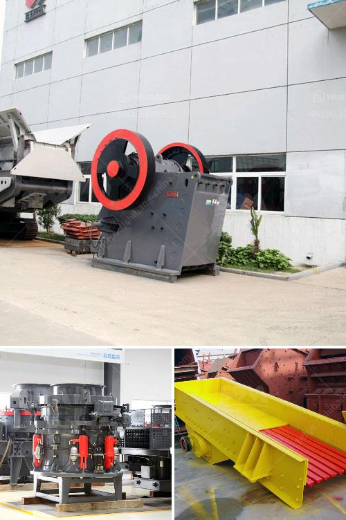

<h3>basalt crusher supplier</h3>
Basalt, a commonly occurring igneous rock, is widely used for construction purposes. Its unique properties make it an ideal material for various applications, ranging from building roads to producing concrete. However, the process of obtaining basalt in a usable form requires the use of a crusher. A basalt crusher supplier plays a crucial role in the process of obtaining basalt materials and ensuring their usability.

One of the key players in this industry is the basalt crusher supplier. They provide essential equipment for the crushing and processing of basalt rocks. The crusher is responsible for reducing the size of the raw basalt materials and making them suitable for various construction applications. Consequently, the selection of a reliable and efficient basalt crusher supplier is of utmost importance.

When choosing a basalt crusher supplier, there are several factors to consider. The first and foremost is the quality of the equipment provided. The supplier should offer crushers that are durable, efficient, and capable of handling large volumes of basalt rocks. A high-quality crusher not only ensures smooth operations but also reduces the risk of breakdowns, which can cause delays in construction projects.

Another crucial factor to consider is the after-sales support provided by the basalt crusher supplier. Equipment maintenance and troubleshooting are inevitable, so it is essential to choose a supplier that offers prompt and effective support. This can include on-site assistance, spare parts availability, and technical consultation. A responsive supplier ensures that any issues with the crusher can be resolved quickly, minimizing downtime and reducing the impact on construction timelines.

Furthermore, the availability of a wide range of crushers is also a significant consideration. Different construction projects may require crushers of varying sizes and capacities. A versatile supplier that offers a range of options can cater to the specific needs of different contractors and construction projects. This allows for greater flexibility and the optimization of the crushing process.

Lastly, the cost-effectiveness of the basalt crusher supplied by the supplier is a crucial factor. Contractors are always on the lookout for equipment that delivers value for money. The supplier should provide competitive pricing without compromising on the quality and performance of the crusher. This ensures that contractors can maximize their returns on investment and minimize their overall project costs.

In conclusion, the role of a basalt crusher supplier in the construction industry cannot be overstated. The supplier provides essential equipment that is responsible for processing raw basalt rocks into usable materials. When choosing a supplier, factors such as equipment quality, after-sales support, range of crushers offered, and cost-effectiveness should be taken into consideration. By selecting a reliable and efficient supplier, contractors can ensure smooth construction operations and achieve successful project outcomes.
<h3>Contact us</h3><ul><li><strong>Whatsapp:&nbsp;<a href="https://wa.me/8613661969651">+8613661969651</a></strong></li><li><a href="https://swt.shibang-china.com/?git&amp;zhl&amp;basalt crusher supplier"><strong>Online Service(chat now)</strong></a></li></ul><h3>Related</h3><ul><li><a href='second hand quarry crusher machinery price in india.md'>second hand quarry crusher machinery price in india</a></li><li><a href='limestone ball mill in egypt.md'>limestone ball mill in egypt</a></li><li><a href='30 x 42 portable jaw crusher for sale.md'>30 x 42 portable jaw crusher for sale</a></li><li><a href='aggregate manufacturing process.md'>aggregate manufacturing process</a></li><li><a href='rock sand plant feasibility report.md'>rock sand plant feasibility report</a></li></ul>