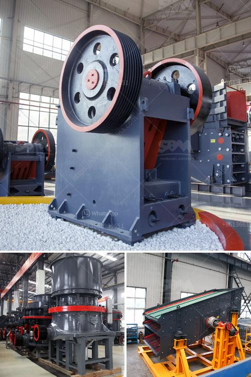

<h3>basalt crushing machinery processing line</h3>
Basalt, a common igneous rock formed from the rapid cooling of basaltic lava, is widely used in various construction and engineering applications. As a result, the demand for basalt crushing machinery is also increasing.

The basalt crushing process is the basis for the crushing of hard and wear-resistant materials. A typical basalt crushing production line comprises the following components: vibrating feeder, primary jaw crusher, secondary cone crusher, vibrating screen, and belt conveyor.

The basalt is evenly fed through the vibrating feeder, and the materials are initially crushed by the primary jaw crusher. The crushed materials are then conveyed to the secondary cone crusher for further crushing. After being finely crushed, the materials are screened by the vibrating screen, and the oversized materials are returned to the secondary cone crusher for re-crushing. The final products are conveyed by the belt conveyor for storage or further processing.

One of the key advantages of basalt crushing machinery is its high efficiency and low energy consumption. The basalt crushing process does not require excessive manpower, which makes it cost-effective for large-scale operations. Additionally, the machinery operates at a high crushing ratio, further enhancing its efficiency.

Another important aspect of basalt crushing machinery is its ability to produce uniform and high-quality end products. The secondary cone crusher plays a crucial role in achieving this outcome. Its unique design and crushing principle ensure the production of well-graded and cubical-shaped aggregates. These high-quality end products are in high demand in the construction industry.

Furthermore, basalt crushing machinery is also known for its durability and low maintenance requirements. The materials used in the construction of the machinery are specially selected to withstand the harsh and abrasive nature of basalt. This ensures that the machinery can operate efficiently even under extreme conditions.

In recent years, with the rapid development of infrastructure construction, the demand for basalt crushing machinery has skyrocketed. Infrastructure projects such as highways, railways, airports, and buildings require a constant supply of high-quality aggregates. Basalt, with its excellent physical and mechanical properties, has become a popular choice for these projects.

In conclusion, basalt crushing machinery processing line plays a vital role in the construction industry. Its high efficiency, low energy consumption, production of uniform and high-quality end products, as well as its durability and low maintenance requirements, make it an indispensable tool for developers and contractors. The continuous advancements in basalt crushing machinery ensure that it will continue to meet the growing demand for high-quality aggregates in the future.
<h3>Contact us</h3><ul><li><strong>Whatsapp:&nbsp;<a href="https://wa.me/8613661969651">+8613661969651</a></strong></li><li><a href="https://swt.shibang-china.com/?git&amp;zhl&amp;basalt crushing machinery processing line"><strong>Online Service(chat now)</strong></a></li></ul><h3>Related</h3><ul><li><a href='milling and grinding machine.md'>milling and grinding machine</a></li><li><a href='mines de cobalt de cuivre de la zambie.md'>mines de cobalt de cuivre de la zambie</a></li><li><a href='mobile coal cone crusher for hire malaysia.md'>mobile coal cone crusher for hire malaysia</a></li><li><a href='stone crusher in nairobi for sale.md'>stone crusher in nairobi for sale</a></li><li><a href='grinding equipments grinding equipments.md'>grinding equipments grinding equipments</a></li></ul>