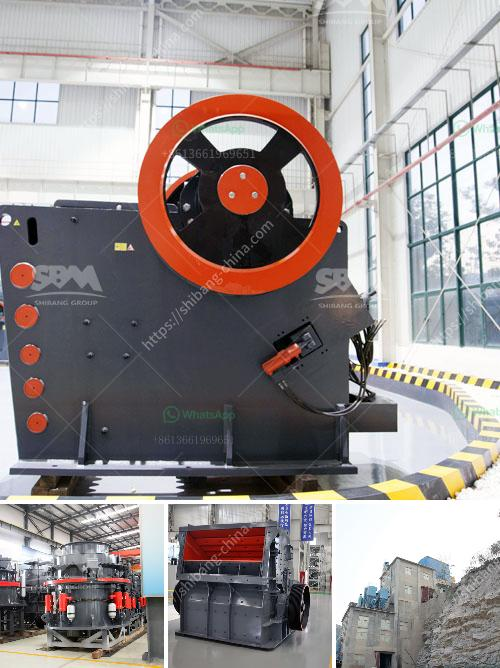

<h3>basalt fiber production lines</h3>
Basalt fiber production lines have gained significant importance in various industries due to their exceptional properties and numerous applications. Basalt fiber is a material derived from volcanic rocks, primarily basalt, which are melted and extruded to form continuous fibers. These fibers are then spun into yarns and further processed into various textile forms like mats, rovings, and tapes.

The manufacturing process of basalt fiber involves several stages. Firstly, the basalt rocks are crushed into small particles and then heated at high temperatures in a furnace. Through the process of melting, the rocks are converted into molten basalt, which is then extruded through small nozzles. The extruded material is rapidly cooled and solidified, forming continuous basalt fibers that are collected and wound into spools.

The production lines for basalt fiber typically consist of several key components. One important component is the furnace where the basalt rocks are heated to high temperatures. These furnaces are designed to withstand extreme heat and facilitate the melting process effectively. The molten basalt is then passed through a platinum-rhodium alloy bushing, which has a specific number of nozzles for controlling the thickness and diameter of the fibers.

Another crucial component of the production line is the cooling system. It is essential to rapidly cool the extruded basalt fibers to ensure their solidification and integrity. This is typically achieved using a gas cooling system that blows cold air onto the fibers as they are extruded. The cooled fibers are then collected on a winding unit where they are wound onto spools for further processing.

The production lines for basalt fiber can vary in capacity, ranging from small-scale lines with lower production rates to large-scale lines capable of producing a significant volume of fibers. However, a typical production line with an output capacity of around 1000 to 2000 tons per year requires substantial investments, including the machinery, raw materials, and trained personnel.

Basalt fiber has gained popularity in various industries due to its exceptional properties. It is known for its high strength-to-weight ratio, excellent resistance to temperature, chemicals, and corrosion, and its superior mechanical properties. These characteristics make basalt fiber an ideal material for applications in the aerospace, automotive, construction, and textile industries.

In the aerospace industry, basalt fiber is used in the manufacturing of composite materials for aircraft and spacecraft structures. Its lightweight nature and high strength make it an excellent choice for reducing the overall weight of aircraft while maintaining structural integrity.

In the automotive industry, basalt fiber is used for reinforcing plastic components, reducing weight, and enhancing the impact resistance of various parts. This helps in improving fuel efficiency and overall safety.

In the construction industry, basalt fiber is widely used for reinforcing concrete structures. The fibers are added to the concrete mix to enhance its tensile strength, prevent cracking, and improve durability.

Basalt fiber is also utilized in the textile industry for the production of fabrics, ropes, and tapes. These textile forms have excellent fire resistance and insulation properties, making them suitable for applications in high-temperature environments.

In conclusion, basalt fiber production lines play a crucial role in meeting the growing demand for this remarkable material. The advanced manufacturing processes and equipment used in these production lines allow for efficient and cost-effective production of basalt fibers. With their exceptional properties and versatility, basalt fibers are poised to make a significant impact across various industries and revolutionize the way we design and manufacture products.
<h3>Contact us</h3><ul><li><strong>Whatsapp:&nbsp;<a href="https://wa.me/8613661969651">+8613661969651</a></strong></li><li><a href="https://swt.shibang-china.com/?git&amp;zhl&amp;basalt fiber production lines"><strong>Online Service(chat now)</strong></a></li></ul><h3>Related</h3><ul><li><a href='suppliers of crush or rocks pretoria.md'>suppliers of crush or rocks pretoria</a></li><li><a href='gypsum crushing machine.md'>gypsum crushing machine</a></li><li><a href='vertical mill for calcite.md'>vertical mill for calcite</a></li><li><a href='mobile crusher in uae for sale.md'>mobile crusher in uae for sale</a></li><li><a href='advantages of jaw crushers.md'>advantages of jaw crushers</a></li></ul>