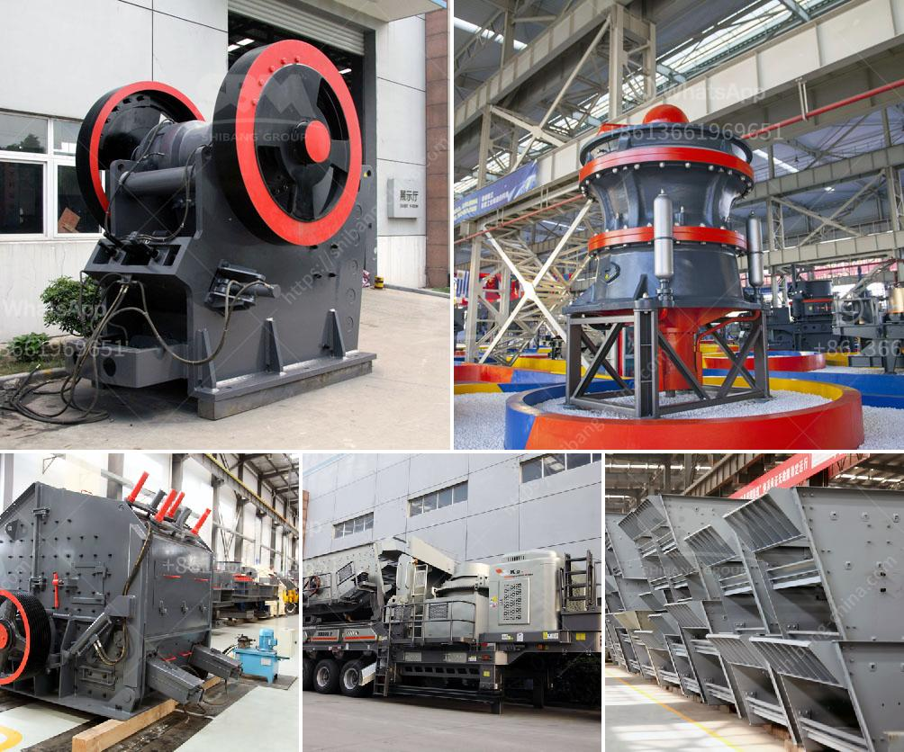

<h3>basalt processing line</h3>
Basalt is a basic igneous rock that forms from the solidification of lava. It is one of the most common rock types on Earth, with basaltic rocks covering large areas of the ocean floor and accounting for a substantial portion of volcanic activity. Basalt has a range of uses in various industries, including construction, road building, and landscaping, making its processing an essential part of modern infrastructure and development.

A basalt processing line is a series of basalt production equipment that includes crushers, feeders, conveyors, and screens. It is widely used in basalt mining and quarrying plants, basalt production line can help produce basalt aggregate, basalt sand, and basalt powder for concrete, asphalt, and other construction materials. The basalt processing line used in actual production line designed by SBM includes the feeding machine, main crusher machine, screening machine and the beneficiation equipment.

Vibrating feeder will send the raw materials from the extraction site to the main crusher machine. The primary crusher is a jaw crusher that crushes basalt into smaller pieces. Secondary crushers or cone crushers are used for further crushing. The materials transferred to the vibrating screen to be separated into different sizes. The final crushed basalt products can be used in asphalt and concrete aggregate, road construction materials, and more.

Basalt processing line boasts excellent performance and high productivity. It is suitable for various applications, and its investment prospects are promising. With the continuous development of infrastructure construction, demand for basalt as a construction material will continue to rise. Therefore, establishing a basalt processing line can be a profitable venture.

In conclusion, basalt processing line plays a vital role in the modern construction industry. By using high-quality basalt as a foundation material, it ensures the durability and longevity of infrastructures. Investing in a basalt processing line can bring significant benefits for construction companies and contribute to sustainable development in the long run.
<h3>Contact us</h3><ul><li><strong>Whatsapp:&nbsp;<a href="https://wa.me/8613661969651">+8613661969651</a></strong></li><li><a href="https://swt.shibang-china.com/?git&amp;zhl&amp;basalt processing line"><strong>Online Service(chat now)</strong></a></li></ul><h3>Related</h3><ul><li><a href='stone crushing production line zenith.md'>stone crushing production line zenith</a></li><li><a href='puzzolana 200 tph stage aggregate crushing.md'>puzzolana 200 tph stage aggregate crushing</a></li><li><a href='grinding mill plant cost.md'>grinding mill plant cost</a></li><li><a href='chrome crushing plant.md'>chrome crushing plant</a></li><li><a href='find fine jaw crusher in china.md'>find fine jaw crusher in china</a></li></ul>