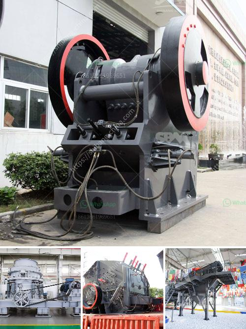

<h3>bauxite crushing processing equipments</h3>
Bauxite is a sedimentary rock with a relatively high aluminum content. It is the world's main source of aluminum and is widely used in various industries like the construction, transportation, and packaging industries. To extract aluminum from bauxite, different processes are required, one of which is crushing.

Bauxite crushing processing equipment is the key equipment for bauxite ore processing plants. In terms of crushing efficiency and cost, the mainly crushers that are able to process the bauxite ore is the jaw crusher, cone crusher and impact crusher.

Bauxite crushing processing equipment contains a variety of specifications, such as the crushing capacity, the size of the maximum feed, discharging granularity and so on. In addition to different specifications, the crushers can also be configured with different dust and noise protection devices according to the actual needs of customers.

The jaw crusher is designed with a large crushing ratio, high efficiency, and excellent performance. It is suitable for the primary crushing of various ores and bulk materials. The cone crusher is also suitable for the secondary crushing stage of high-hardness materials. The impact crusher is the ideal choice for crushing medium-hard and brittle materials.

In the bauxite processing, the jaw crusher is used in the coarse crushing stage, and the impact crusher is used in the secondary crushing stage. These crushers work together to process the raw bauxite into required sizes. The jaw crusher mainly acts as a primary crusher for bauxite crushing process. The impact crusher often plays the role of secondary crusher. The final product from the impact crusher is usually fine and shaped with cubic particles.

Due to the high-quality and low prices of these crushing equipment, many customers choose them in the bauxite crushing process. They provide reliable operation, low failure rate, and reduce maintenance costs. The maintenance personnel do not need to go to the site to perform maintenance regularly, saving a lot of manpower, material resources, and financial capital.

Moreover, the crushers are equipped with a variety of protective devices to ensure the safety of operators and equipment. For example, the jaw crusher is equipped with a hydraulic device to adjust the discharge port and overload protection, which greatly improves the safety performance of the equipment. The impact crusher is equipped with a hydraulic opening device, which can quickly and conveniently adjust the size of the discharge port, further improving the flexibility and safety of operation.

In conclusion, bauxite crushing processing equipment plays an important role in the bauxite processing plant. The choice of crusher equipment mainly depends on the material type, required final product size, and capacity. With the advantages of high efficiency, low energy consumption, reliable operation, and easy maintenance, crushers are indispensable for the bauxite crushing process. Choosing the right crusher will greatly improve the production efficiency and reduce the investment costs.
<h3>Contact us</h3><ul><li><strong>Whatsapp:&nbsp;<a href="https://wa.me/8613661969651">+8613661969651</a></strong></li><li><a href="https://swt.shibang-china.com/?git&amp;zhl&amp;bauxite crushing processing equipments"><strong>Online Service(chat now)</strong></a></li></ul><h3>Related</h3><ul><li><a href='ethiopia conveyor belts china.md'>ethiopia conveyor belts china</a></li><li><a href='limestone coal grinding machinery manufacture in india.md'>limestone coal grinding machinery manufacture in india</a></li><li><a href='stone crushing industry tanzania.md'>stone crushing industry tanzania</a></li><li><a href='how much is a crusher.md'>how much is a crusher</a></li><li><a href='quotation for hydraulic cone crusher.md'>quotation for hydraulic cone crusher</a></li></ul>