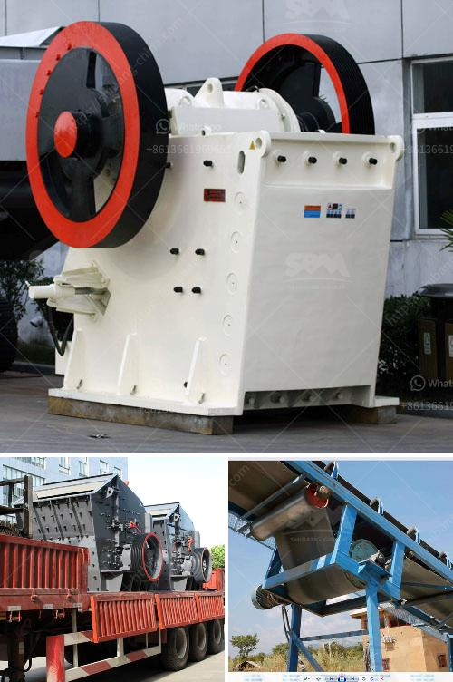

<h3>bauxite mines crusher in dubai</h3>
Bauxite mining in Dubai involves crushing and grinding the raw ore to obtain the appropriate particle size. The starting material for this process is bauxite, which is a naturally occurring rock formed by the weathering of aluminum-rich rocks. The crushing process ensures that the bauxite is suitable for the refining process, while also reducing its size for transportation.

Crushers are used in the bauxite mines to break the raw material into smaller pieces for easier transportation and further processing. These machines come in different types, such as jaw crushers, gyratory crushers, and cone crushers. Each type of crusher has its own unique features, but they all work to achieve the same goal: breaking down the raw ore into smaller particles.

Jaw crushers are commonly used in bauxite mining operations due to their ability to crush tough and abrasive materials. The material is fed into the jaw crusher from the top and is progressively crushed as it moves towards the bottom. The crushed particles are then discharged through the narrow gap at the bottom of the crusher.

Gyratory crushers are another popular choice in bauxite mining operations. These crushers consist of a large conical-shaped crushing head that rotates eccentrically within a stationary outer concave. The raw ore is fed into the top of the crusher and is crushed between the crushing head and the stationary concave. The crushed material then exits through the bottom of the crusher.

Cone crushers, on the other hand, are built with a rotating mantle and an eccentrically rotating crushing chamber. The raw ore is fed into the top of the cone crusher and is crushed as it travels down towards the bottom of the chamber. The crushed material then exits through the bottom of the crusher, similar to gyratory crushers.

Crushers in bauxite mining operations are designed to handle large-sized raw materials efficiently. They can process the ore into different sizes depending on the desired final product. After the initial crushing, the ore is then sent for further grinding and refining processes to extract the valuable aluminum.

In conclusion, crushers play a crucial role in bauxite mining operations in Dubai. They are responsible for breaking down the raw ore into smaller, more manageable pieces for transport and refining. The type of crusher used depends on various factors such as the hardness and abrasiveness of the ore. However, all crushers aim to achieve the same goal: transforming the raw bauxite into a refined product that can be used for various applications.
<h3>Contact us</h3><ul><li><strong>Whatsapp:&nbsp;<a href="https://wa.me/8613661969651">+8613661969651</a></strong></li><li><a href="https://swt.shibang-china.com/?git&amp;zhl&amp;bauxite mines crusher in dubai"><strong>Online Service(chat now)</strong></a></li></ul><h3>Related</h3><ul><li><a href='ultra fine powder grinding machine.md'>ultra fine powder grinding machine</a></li><li><a href='river pebble crusher.md'>river pebble crusher</a></li><li><a href='track mobile crusher.md'>track mobile crusher</a></li><li><a href='find fine jaw crusher in china.md'>find fine jaw crusher in china</a></li><li><a href='mine to mill optimization and reconciliation.md'>mine to mill optimization and reconciliation</a></li></ul>