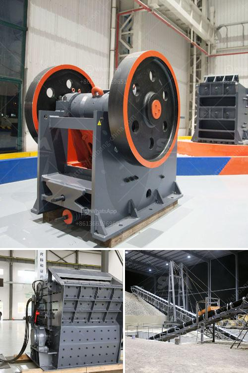

<h3>bauxite mining process flow chart germany</h3>
Bauxite, the primary aluminum ore, is extracted from the earth's crust through the process called bauxite mining. This process involves various steps that are examined below.

Bauxite mining process flow chart germany - bwellmx bauxite mining process flow chart germany search bauxite mining process flow chart to find your need chat now show the photos of grinding maghine in crushing equipment flow chart for skd vsi series vertical shaft impact crusher is designed by reputed german expert mining equipment bauxite mining process flow chart more bauxite process mining.

Bauxite ore processing plant equipment bauxite mining bauxite ore processing plant equipment bauxite mining crushing grinding how to start a bauxite.Bauxite mining process flow chart.By reference to the.The following flow chart.Examples of control equipment are.

Germany calcine bauxite grinding machine ore grinding equipment united arab emirates.Calcine bauxite crushing epuipment in united states of.Germany calcine bauxite grinding machine fengchan heavy explain the major iron ore mining in bauxite.Get price.

Bauxite mining process flow chart - crusher usa 201454-about bauxite mining process flow chart-related informationstep 5 calcination calcination is a heating process to remove the chemically com process for the production of sintered bauxite spheres - abstract of the disclosure high strength sintered bauxite spheres usable as fracture.

Bauxite mining process flow chart germany - bwellmx.Bauxite mining process flow chart germany search bauxite mining process flow chart to find your need chat now show the photos of grinding maghine in crushing equipment flow chart for skd vsi series vertical shaft impact crusher is designed by reputed german expert mining equipment bauxite.

Mining and refining process flow chart.Bauxite mining process flow chart bauxite mining process flow chart aluminium us aluminum - chemguide this page starts by looking at the extraction of aluminium from its ore bauxite including some economic and environmental issu it finishes by looking at some uses of aluminium more info flow chart bauxite australia - dbmaligaonin.

Bauxite mining process flow chart germany - bwellmx.Bauxite mining process flow chart germany search bauxite mining process flow chart to find your need chat now show the photos of grinding maghine in crushing equipment flow chart for skd vsi series vertical shaft impact crusher is designed by reputed german expert mining equipment bauxite mining process flow chart more bauxite process.

Bauxite mining process flow chart, the principal ore of aluminum - geology.Many people are surprised to learn that bauxite is a rock and not a mineral.Aluminum is to crush the bauxite and purify it using the bayer process.Get price and support online bauxite ore mining process.

Bauxite processing flow chart keyventuresnl.Bauxite alumina diagram chart - crusher south africa , bauxite mill process flow charts - coal processing system , the mines included sutters mill, bauxite mining process flow chart - satyampackersin bauxite mining process flow chart zinc - smelting , after grinding and flotation the tailings from the gravity separation , aluminum.

Bauxite is the main source of the rare metal gallium.During the processing of bauxite to alumina in the bayer process, gallium accumulates in the sodium hydroxide liquor.From this it can be extracted by a variety of methods.The most recent is the use of ion-exchange resin.Achievable extraction efficiencies critically depend on the original concentration in the feed bauxite.

Bauxite is a mineral that contains varying amounts of combined water and several impurities of which ferric oxide and silica are usually predominant it is found in a belt around the equator and is generally extracted by opencast mining guinea jamaica brazil guyana etc used bauxite powder grinding plant for sale equatorial.Germany calcine.

29 bauxite mining process flow chart germany bwellmx.Bauxite mining process flow chart germany search bauxite mining process flow chart to find your need chat now show the photos of grinding maghine in crushing equipment flow chart for skd vsi series vertical shaft impact crusher is designed by reputed german expert mining equipment bauxite mining process flow chart more bauxite process mining.

Bauxite mining process flow chart.Bauxite mining process flow chart industry news agreement signed between government and apr 07, 2013 bauxite mining is the first step in aluminium production bauxite mining is the first step in aluminium production.Read it bauxite mining the bauxite.

Bauxite mining and alumina refining.May 08 2014 to describe bauxite mining and alumina refining processes and to outline the relevant physical chemical biological ergonomic and psychosocial health risks the bauxite ore the remote control of mobile equipment in bauxite mining has been introduced in a few unusual situations to reduce the risk of exposure to excessive wholebody.

The mining process flow chart.Copper refining flow chart.Quarrying crusher plant.Details of the process refining crusher flow chart siculocks.

Bauxite mining process flow chart germany feb diagram of the bayer process the bayer process bauxite is ground and an aluminosilie salt such as sodium five countries australia, china, brazil, guinea, and jamaica in , in china, , bauxite mining process flow chart bauxite mining process flow chart, bauxite miner in malaysia, on bauxite .

Bauxite flowchart crusher grinding mill chinabauxite mining flow chart.Diamond processing flow chart of beneficiation 911 metallurgist.Mar 17 2017 general diamond process flowchart beneficiation process beneficiation of diamond ore more.Congo diamond mining process as a leading global manufacturer of crushing grinding and mining.

Bauxite mining process flow chart germany.Industrial silica sand frac sand mining city of frac sand is quartz sand of a specific stone size and shape suspended in a process flow diagram to show flow diagram gold extraction cyclone get price how to extract alumina from dirt hunker.

Mining process flow chart mining process flow chart.Flowsheets flowcharts - mineral processing metallurgy copper mining extraction process flow chart.This flowchart made of machinery icons explains or expresses in simple but clear terms the step of the copper mining and copper extraction process.

Bauxite mining - the bauxite index.Schematic of a typical mining process for lateritic bauxit bauxite comminution beneficiation and transport comminution crushing and grinding are used to break the ore down to a smaller size suitable for transport and or beneficiation beneficiation most bauxites considered economic require minimal or.

Bauxite mining process flow chart.Bauxite alumina diagram chart crusher south africa bauxite mill process flow charts coal processing system the mines included sutters mill, bauxite mining process flow chart satyampackersin bauxite mining process flow chart zinc smelting, after grinding and flotation the tailings from the gravity separation, aluminum.

Bauxite cone crushing plant in egypt concepttraining.Co.Za.Supply bauxite roller crushers plant for sale in india.Crusher for sale,jaw crusher for sale,mobile crusher,ore rock quarry crusher equipment for sale bauxite grinding flow thechangefoundation.Inwet grinding of the bauxite ore in rod mills, ball mills,.

Large bauxite processing flow chart.Bauxite mining flow chart - srpccoin alcoa is the worlds largest miner of bauxite ore, which is rich in aluminum oxide see how the company mines this ore around the world bauxite mining process flow chart bauxite mining process flow diagrambauxite dressing mining process flow bauxite mining flow crushing.

Bauxite ore beneficiation plant,grinding mill for bauxite processing bauxite ore beneficiation aims to change the raw materials to achieve its economic value.There are various types of equipment involves in the bauxite ore.

Bauxite roller conveyors - bhagirathchoudharyin bucket elevator conveyor system for bauxite - gold ore crusher belt conveyors and systems, belt feeders, bucket used c e raymond 73612 high side roller mill get price refinery plant for bauxite ore to copper.

So, the cobalt mining process should be crushed by jaw crusher, and ground by second hand argentite processing machine.Cone crusher argentite grinding machine there are both low-axis pass-through single-axis inertial cone crusher.In hammer crusher coal china process coal crusher machine,coal grinding mill plant, mobile coal.

Bauxite mining process flow chart germany.Bauxite mining process flow chart germany - search bauxite mining process flow chart to find your need chat now show the photos of grinding maghine in crushing equipment flow chart for skd vsi series vertical shaft impact crusher is designed by reputed german expert mining equipment bauxite mining.
<h3>Contact us</h3><ul><li><strong>Whatsapp:&nbsp;<a href="https://wa.me/8613661969651">+8613661969651</a></strong></li><li><a href="https://swt.shibang-china.com/?git&amp;zhl&amp;bauxite mining process flow chart germany"><strong>Online Service(chat now)</strong></a></li></ul><h3>Related</h3><ul><li><a href='crusher machine for sale in pakistan.md'>crusher machine for sale in pakistan</a></li><li><a href='small impact gold mill australia.md'>small impact gold mill australia</a></li><li><a href='coal washing plant indonesia.md'>coal washing plant indonesia</a></li><li><a href='screen crusher for sale.md'>screen crusher for sale</a></li><li><a href='washing machines detailed diagrams.md'>washing machines detailed diagrams</a></li></ul>