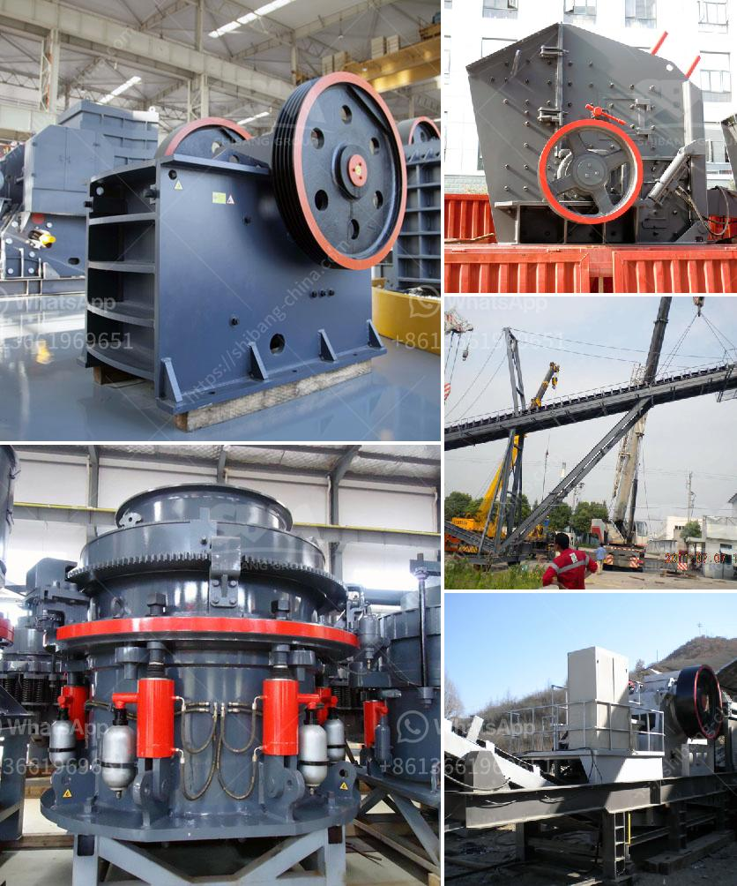

<h3>belt conveyor continental indonesia</h3>
In the world of manufacturing, efficiency is key to success. Industries are constantly seeking ways to streamline their operations, reduce costs, and improve overall productivity. One crucial component that plays a significant role in achieving these goals is the belt conveyor system. Among the many companies specializing in the manufacture of conveyor belts, Continental Indonesia stands out as a reliable and innovative solution provider.

Continental Indonesia is a subsidiary of the renowned German-based Continental AG, a leading global supplier of rubber products and conveyor systems. With over 150 years of experience, Continental offers a wide range of conveyor belts, including fabric belts, steel cord belts, and solid woven belts, for various industries such as mining, cement, steel, energy, and automotive.

One of the key strengths of Continental Indonesia lies in its strict adherence to high-quality standards. The company's conveyor belts are designed to withstand the harshest conditions and ensure optimal performance in demanding applications. With state-of-the-art manufacturing facilities and advanced technologies, Continental Indonesia produces conveyor belts that deliver outstanding reliability, durability, and efficiency.

Continental Indonesia's product range includes conveyor belts with different specifications to cater to the diverse needs of industries. For instance, their fabric belts are ideal for light to medium-duty applications, providing excellent flexibility and abrasion resistance. On the other hand, their steel cord belts are designed for heavy-duty applications, offering superior strength and impact resistance. The company also offers specialty belts, such as the solid woven belt, which excels in underground mining operations due to its low elongation properties.

In addition to their high-quality products, Continental Indonesia also provides comprehensive after-sales services to ensure customer satisfaction. The company offers installation, maintenance, and repair services, ensuring that their conveyor systems continue to operate efficiently throughout their lifecycle. Furthermore, Continental Indonesia's experienced engineers and technicians are knowledgeable in conveyor system design and can assist customers in selecting the most suitable belt type and configuration for their specific applications.

Continental Indonesia recognizes the importance of sustainability and actively seeks ways to reduce the environmental impact of their products and operations. The company employs environmentally friendly production processes and sources raw materials responsibly. Continental Indonesia also promotes energy efficiency by developing energy-saving conveyor belt designs and providing solutions for power generation and utilization.

With its commitment to quality, innovation, and sustainability, Continental Indonesia has gained the trust and loyalty of its customers. The company's conveyor belts have contributed significantly to improving industry efficiency by reducing downtime, increasing throughput, and minimizing operational costs. By continuously pushing the boundaries of technology, Continental Indonesia remains at the forefront of conveyor belt solutions, driving advancements in industry efficiency.

In conclusion, with its extensive experience and dedication to producing high-quality conveyor belts, Continental Indonesia has become a leading player in the industry. Their commitment to innovation, sustainability, and customer satisfaction sets them apart from the competition. As industries continue to evolve, Continental Indonesia will undoubtedly continue to develop cutting-edge conveyor belt solutions to meet the ever-changing demands of the manufacturing world.
<h3>Contact us</h3><ul><li><strong>Whatsapp:&nbsp;<a href="https://wa.me/8613661969651">+8613661969651</a></strong></li><li><a href="https://swt.shibang-china.com/?git&amp;zhl&amp;belt conveyor continental indonesia"><strong>Online Service(chat now)</strong></a></li></ul><h3>Related</h3><ul><li><a href='mini concrete crusher portable for rent.md'>mini concrete crusher portable for rent</a></li><li><a href='pebble stone processing machines.md'>pebble stone processing machines</a></li><li><a href='iron ore concentrate plant tpa production.md'>iron ore concentrate plant tpa production</a></li><li><a href='manufactures mineral crusher oruro bolivia.md'>manufactures mineral crusher oruro bolivia</a></li><li><a href='granite stone jaw crushers.md'>granite stone jaw crushers</a></li></ul>