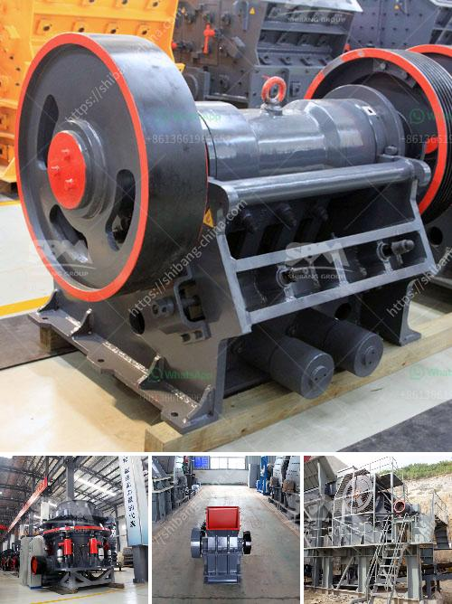

<h3>belt conveyor price</h3>
The price of belt conveyors is an essential factor to consider when purchasing this efficient and versatile equipment. Belt conveyors are widely used in various industries such as mining, manufacturing, food processing, packaging, and logistics due to their ability to transport materials and products continuously and efficiently. However, it is crucial to understand the factors that contribute to the price of belt conveyors to make an informed decision.

One of the significant factors affecting the price of belt conveyors is the size and capacity requirements. Belt conveyors are available in different sizes and configurations, and the price can vary depending on the length, width, and load capacity. Generally, longer and wider conveyors with higher load capacities tend to be more expensive due to the additional materials and components required for their construction.

The type of belt used in the conveyor is another factor influencing the price. There are various types of belts available, each designed for specific applications. For instance, conveyor belts used in the mining industry need to withstand harsh conditions and heavy loads, making them more expensive compared to belts used in less demanding environments. Moreover, the technology involved in manufacturing specialized belts can also impact their price.

The materials used in the construction of belt conveyors can significantly affect their cost. Conveyors can be constructed using different materials such as stainless steel, aluminum, or mild steel. Stainless steel conveyors are often more expensive due to their durability and resistance to corrosion, making them suitable for food processing and pharmaceutical industries. On the other hand, conveyors made from mild steel may be more affordable, but they may require additional maintenance to prevent rusting.

The complexity of the conveyor system and additional features also contribute to the price. Some conveyors may require specialized components such as motorized pulleys, adjustable height legs, or custom-designed transfer chutes. These additional features and components not only affect the overall cost but also impact the performance and efficiency of the conveyor system.

The reputation and reliability of the manufacturer or supplier can also influence the price of belt conveyors. Established manufacturers with a strong track record of delivering high-quality and reliable conveyors may have higher prices compared to lesser-known manufacturers. However, it is essential to consider the long-term benefits of investing in a reputable brand as the performance, durability, and after-sales service can greatly affect the overall value of the conveyor system.

In conclusion, the price of belt conveyors can vary significantly depending on various factors such as size, capacity, belt type, construction materials, additional features, and the reputation of the manufacturer. It is crucial to carefully evaluate the specific requirements of the application and consider the long-term benefits. Investing in a high-quality and reliable conveyor system may require a higher upfront cost but can result in improved productivity, reduced downtime, and overall cost savings in the long run.
<h3>Contact us</h3><ul><li><strong>Whatsapp:&nbsp;<a href="https://wa.me/8613661969651">+8613661969651</a></strong></li><li><a href="https://swt.shibang-china.com/?git&amp;zhl&amp;belt conveyor price"><strong>Online Service(chat now)</strong></a></li></ul><h3>Related</h3><ul><li><a href='cement plant machine.md'>cement plant machine</a></li><li><a href='stone crusher guptas.md'>stone crusher guptas</a></li><li><a href='quarry plant equipment.md'>quarry plant equipment</a></li><li><a href='used sand wash plant for sale.md'>used sand wash plant for sale</a></li><li><a href='stone crusher plant design pdf.md'>stone crusher plant design pdf</a></li></ul>