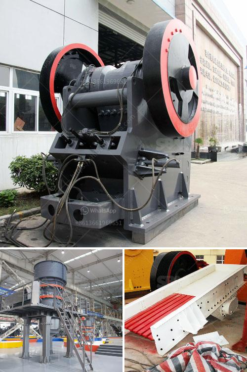

<h3>bentonite granual machine</h3>
Bentonite granule machines are innovative pieces of machinery that aid in the processing of bentonite granules. These machines are designed to evenly distribute bentonite granules on the soil surface and improve the efficiency of the fertilizers used as additives in the soil. Bentonite granule machines are easy to operate and deliver consistent performance, making them a preferred choice for the agricultural industry.

Bentonite is a type of clay that is produced from volcanic ash and has excellent water absorption properties. It is commonly used in agricultural applications due to its ability to retain moisture in the soil and improve its fertility. Bentonite granules are small, spherical pellets that are made by crushing and grinding bentonite clay.

The bentonite granule machine consists of a feeding system, extrusion system, pelletizing system, and drying system. The feeding system introduces bentonite granules into the machine, and the extrusion system shapes the granules into spherical pellets. The pelletizing system then rotates the pellets to ensure uniform size and shape. Finally, the drying system removes any excess moisture, resulting in high-quality and durable bentonite granules.

One of the key advantages of using bentonite granule machines is that they enable the controlled release of nutrients into the soil. These machines can be set to deliver a specific amount of bentonite granules, which ensures accurate fertilization and prevents over-application. This controlled release of nutrients not only saves resources but also eliminates the risk of nutrient runoff, protecting the environment from pollution.

Furthermore, the use of bentonite granules can enhance soil structure and increase its water retention capacity. The granules act as mini reservoirs, absorbing water during rainfall and slowly releasing it to the plant roots as needed. This ensures that the plants receive a steady supply of water, even during dry spells, reducing the need for frequent irrigation.

Bentonite granule machines also offer significant labor-saving benefits. The machines are automated, requiring minimal human intervention. Once the operator sets the desired parameters, the machine can run continuously, producing consistent and high-quality bentonite granules. This frees up laborers to perform other tasks, improving overall operational efficiency.

In addition to agricultural applications, bentonite granule machines are also used in a range of other industries. These machines find use in the production of cat litter, oil and gas drilling fluids, and wastewater treatment, among others. Their versatility and efficiency make them an indispensable tool in various sectors.

In conclusion, bentonite granule machines play a critical role in the agricultural industry by improving soil fertility and nutrient management. These machines provide accurate and consistent application of bentonite granules, leading to improved crop yield and reduced environmental impact. Their labor-saving benefits and versatility make them a valuable asset in various industries. As technology continues to advance, bentonite granule machines are likely to witness further improvements, making them even more efficient and cost-effective.
<h3>Contact us</h3><ul><li><strong>Whatsapp:&nbsp;<a href="https://wa.me/8613661969651">+8613661969651</a></strong></li><li><a href="https://swt.shibang-china.com/?git&amp;zhl&amp;bentonite granual machine"><strong>Online Service(chat now)</strong></a></li></ul><h3>Related</h3><ul><li><a href='india dolomite grinding machine.md'>india dolomite grinding machine</a></li><li><a href='granite stone jaw crushers.md'>granite stone jaw crushers</a></li><li><a href='mobile crushing plant for rent in saudi arabia.md'>mobile crushing plant for rent in saudi arabia</a></li><li><a href='crushing plant in calatagan batangas.md'>crushing plant in calatagan batangas</a></li><li><a href='buy crusher of impact of 10 tph.md'>buy crusher of impact of 10 tph</a></li></ul>