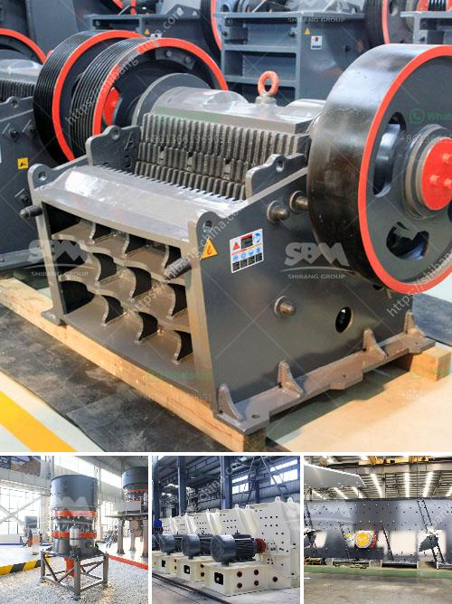

<h3>bentonite plant dimensions</h3>
In the world of industrial plants, appropriate dimensions are crucial for ensuring efficient and optimized operations. The same holds true for bentonite plants, which play a vital role in various industries, including construction, oil and gas drilling, and wastewater treatment.

Bentonite, a clay mineral composed mostly of montmorillonite, is known for its exceptional water-absorbing and swelling properties. The processing of bentonite involves a series of steps, including mining, drying, milling, and packaging. However, the dimensions of a bentonite plant are of utmost importance to guarantee smooth processes and maximum productivity.

One crucial factor in designing a bentonite plant is the required production capacity. The dimensions of the plant need to be determined based on the intended volume of bentonite that needs to be processed. Whether it is a small-scale facility or a large-scale plant, a thorough analysis of production requirements is essential to avoid underutilization or overwhelming the plant's capacity.

Another aspect to consider is the space required for storage. Bentonite, being a bulk material, needs adequate storage facilities to accommodate the harvested clay minerals before processing. Depending on the location, accessibility, and transportation logistics, the plant's dimensions should incorporate sufficient space for storing raw materials and finished products.

Moreover, the dimensions of a bentonite plant must include designated areas for equipment installation. Various machinery and equipment are utilized throughout the processing stages, such as crushers, mills, mixers, and packaging units. Ensuring adequate space for the installation and operation of these machines is paramount for a seamless production flow.

Additionally, considering the environmental impact is crucial when determining the dimensions of a bentonite plant. Implementing proper waste management systems, including waste storage and disposal areas, is essential to minimize the ecological footprint and comply with environmental regulations.

In conclusion, the dimensions of a bentonite plant are pivotal in achieving efficient and optimized operations. Careful consideration of production capacity, storage requirements, machinery installation, and environmental impact ensures the plant's ability to meet demand while minimizing waste. By giving due attention to these dimensions, industries can enhance their bentonite processing capabilities and drive overall operational success.
<h3>Contact us</h3><ul><li><strong>Whatsapp:&nbsp;<a href="https://wa.me/8613661969651">+8613661969651</a></strong></li><li><a href="https://swt.shibang-china.com/?git&amp;zhl&amp;bentonite plant dimensions"><strong>Online Service(chat now)</strong></a></li></ul><h3>Related</h3><ul><li><a href='coal crusher manufacturing machine.md'>coal crusher manufacturing machine</a></li><li><a href='second hand vrm cement mill for sale.md'>second hand vrm cement mill for sale</a></li><li><a href='100tph rock plant used for sale.md'>100tph rock plant used for sale</a></li><li><a href='grinder machine for fine powder.md'>grinder machine for fine powder</a></li><li><a href='china hammer mill.md'>china hammer mill</a></li></ul>