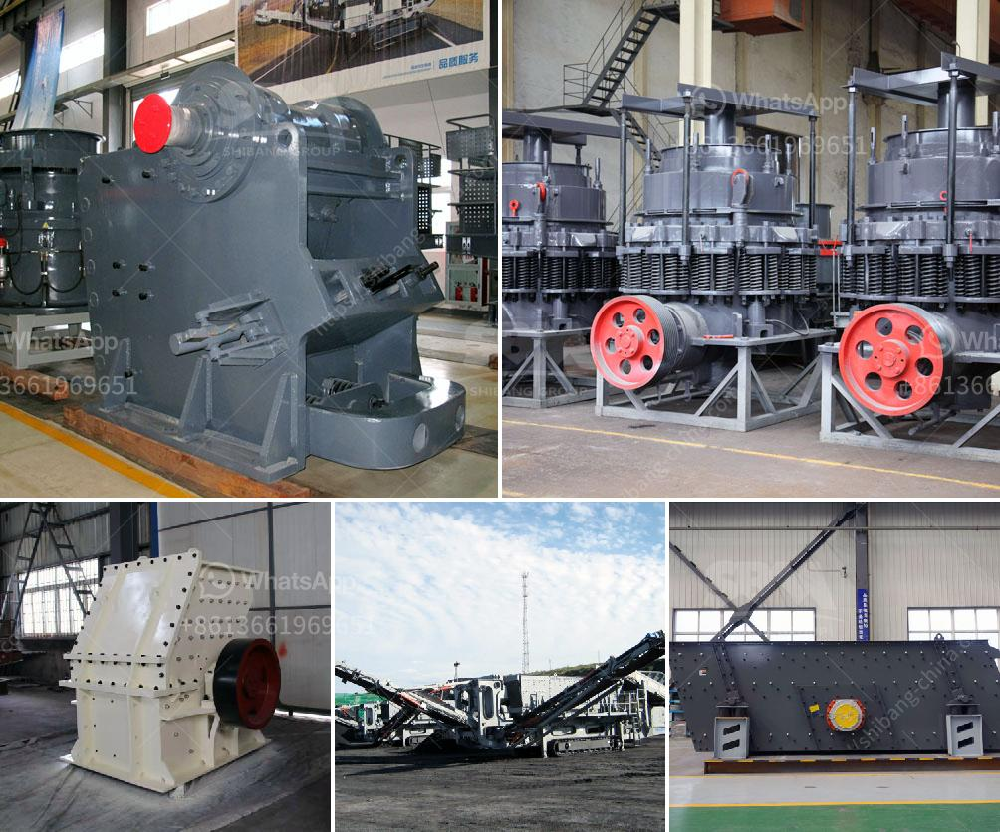

<h3>bentonite plant system</h3>
Bentonite, often referred to as a "miracle mineral," has gained immense popularity in recent years due to its wide range of applications in various industries. One of the significant uses of bentonite is in the field of agriculture, where it plays a crucial role in enhancing soil quality and promoting sustainable farming practices. Bentonite plant systems are utilized to extract and process bentonite into a usable form for agricultural purposes, providing farmers with a powerful tool to improve soil structure, fertility, and crop productivity.

So what exactly is bentonite and why is it so beneficial for agriculture? Bentonite is a naturally occurring clay mineral that possesses unique properties, making it an excellent soil amendment. It has a high cation-exchange capacity (CEC), which means that it has the ability to hold and exchange nutrients, especially essential plant nutrients like potassium, calcium, and magnesium. This property makes bentonite ideal for increasing the nutrient availability in the soil, providing plants with a continuous supply of vital elements for growth and development.

Additionally, bentonite has the remarkable ability to improve soil structure and water retention. Its tiny particles can absorb and retain large quantities of water, forming a gel-like substance that helps to prevent soil erosion and retain moisture in the root zone. This is particularly important in areas prone to drought or those with sandy or compacted soils. By adding bentonite to such soils, farmers can enhance water infiltration and retention, consequently reducing water usage and irrigation requirements. Moreover, by improving water management, farmers can protect their crops from drought stress and maintain optimal soil moisture levels for high yields.

The application of bentonite plant systems is simple and cost-effective. Firstly, the bentonite is extracted from mines and processed to remove impurities, resulting in a pure form of bentonite suitable for agricultural use. It is then either applied directly to the soil surface or, more commonly, tilled into the soil using conventional agricultural machinery. The amount of bentonite required depends on the soil type and condition, but generally, a small quantity is sufficient to achieve significant improvements in soil quality.

Apart from its direct benefits to soil and crop health, bentonite plant systems also contribute to sustainable agriculture and environmental preservation. Bentonite is a natural material that is non-toxic and safe for both human and animal health. Its use in agriculture reduces the need for synthetic chemical fertilizers and pesticides, minimizing the risk of groundwater contamination and soil degradation. Additionally, bentonite can help in the remediation of soil contaminated with heavy metals and toxins, making it an eco-friendly solution for restoring polluted lands.

In conclusion, bentonite plant systems have revolutionized the agricultural industry by providing farmers with a powerful tool to improve soil quality and promote sustainable farming practices. The unique properties of bentonite, such as its high CEC, water-retention abilities, and soil structure improvement capabilities, make it an invaluable soil amendment. By incorporating bentonite into their farming practices, farmers can enhance nutrient availability, conserve water, increase crop yields, reduce environmental pollution, and ensure the long-term sustainability of their agricultural operations.
<h3>Contact us</h3><ul><li><strong>Whatsapp:&nbsp;<a href="https://wa.me/8613661969651">+8613661969651</a></strong></li><li><a href="https://swt.shibang-china.com/?git&amp;zhl&amp;bentonite plant system"><strong>Online Service(chat now)</strong></a></li></ul><h3>Related</h3><ul><li><a href='limestone crushing equipment.md'>limestone crushing equipment</a></li><li><a href='mining equipment and hire zimbabwe.md'>mining equipment and hire zimbabwe</a></li><li><a href='hammer mill production location in nigeria.md'>hammer mill production location in nigeria</a></li><li><a href='second hand jaw crushers in holland.md'>second hand jaw crushers in holland</a></li><li><a href='grinding mill for corundum.md'>grinding mill for corundum</a></li></ul>