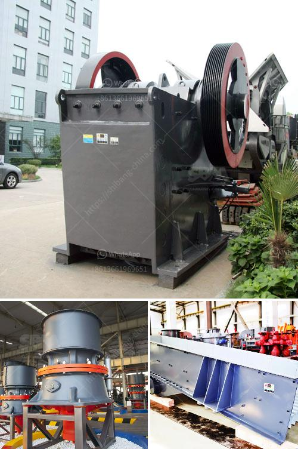

<h3>best grinding mills of chslk limestone</h3>
Chalk limestone is a soft sedimentary rock that is commonly used in various industries, including agriculture, construction, and even artists' materials. To transform chalk limestone into a fine powder, grinding mills are essential equipment. These mills pulverize the limestone into a powder form suitable for numerous applications.

When it comes to choosing the best grinding mill for chalk limestone, several factors need to be considered, including efficiency, durability, and output quality. In this article, we will explore some of the top grinding mills available in the market.

Raymond Mill, also known as Raymond Roller Mill, is a widely-used grinding mill for chalk limestone. It has a high efficiency and low energy consumption. The output size is adjustable, making it suitable for large-scale production. With a stable performance and long lifespan, Raymond Mill is a preferred choice for many manufacturers.

Ball Mill is another popular grinding mill for chalk limestone. It is more suitable for wet grinding rather than dry grinding. It is capable of grinding different types of materials, including chalk limestone, with high precision. Ball Mill reduces the limestone into a fine powder and is commonly used in the construction industry.

Vertical Roller Mill is a grinding mill that combines crushing, grinding, and drying functions in one machine. It is suitable for a wide range of materials, including chalk limestone. This mill has a compact design and takes up less space compared to other mills. It also provides excellent drying capabilities, making it ideal for processing chalk limestone.

Ultrafine Mill is a grinding mill that produces an ultra-fine powder suitable for various applications. This mill is known for its high production capacity and low energy consumption. It can grind chalk limestone to a very fine particle size, resulting in a high-quality powder. Ultrafine Mill is commonly used in the paint, paper, and plastic industries.

Hammer Mill is a grinding mill that uses high-speed rotating hammers to crush and pulverize chalk limestone. It is ideal for preliminary crushing of large chunks of limestone before further processing in other mills. Hammer Mill is versatile and can be used for both coarse and fine grinding. Its simplicity of operation and maintenance make it a popular choice for many manufacturers.

In conclusion, choosing the best grinding mill for chalk limestone depends on various factors, including efficiency, durability, and output quality. Raymond Mill, Ball Mill, Vertical Roller Mill, Ultrafine Mill, and Hammer Mill are some of the top grinding mills available in the market. Each mill has its unique characteristics and benefits. Manufacturers should carefully evaluate their requirements and choose the grinding mill that best suits their needs. By selecting the right grinding mill, manufacturers can efficiently process chalk limestone and produce high-quality powders for their respective industries.
<h3>Contact us</h3><ul><li><strong>Whatsapp:&nbsp;<a href="https://wa.me/8613661969651">+8613661969651</a></strong></li><li><a href="https://swt.shibang-china.com/?git&amp;zhl&amp;best grinding mills of chslk limestone"><strong>Online Service(chat now)</strong></a></li></ul><h3>Related</h3><ul><li><a href='limestone grinding system.md'>limestone grinding system</a></li><li><a href='limestone crusher hammers.md'>limestone crusher hammers</a></li><li><a href='puzolana 250 tph crusher.md'>puzolana 250 tph crusher</a></li><li><a href='quartz stone processing machine.md'>quartz stone processing machine</a></li><li><a href='small jaw crusher for sale in california.md'>small jaw crusher for sale in california</a></li></ul>