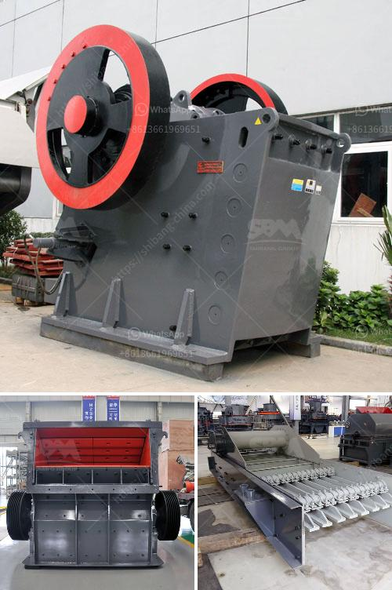

<h3>bhel coal mill spares manufacturers</h3>
BHEL has been providing innovative and high-quality products to the power generation industry for over 70 years. As a leading manufacturer of coal mill spare parts, BHEL has established itself as a trusted name in the industry. Their dedication to precision engineering and commitment to customer satisfaction has made them the go-to choice for many power plants around the world.

One of the key components of a coal-fired power plant is the coal mill. The coal mill grinds the raw coal into fine powder that can be used as fuel in the power plant. The efficiency of the milling process directly impacts the efficiency of the entire power plant. A poorly performing coal mill can lead to inefficient combustion, increased emissions, and reduced power output. This is where BHEL coal mill spares manufacturers step in.

BHEL coal mill spares manufacturers ensure reliable performance of the coal mill by producing high-quality components that can withstand the harsh operating conditions of a coal-fired power plant. These durable parts are designed to resist wear and tear and can endure extreme temperatures and pressure. BHEL understands the importance of these spare parts in maintaining the overall efficiency and productivity of the power plant.

Moreover, BHEL coal mill spares manufacturers offer a wide range of products to meet the diverse needs of the power generation industry. From grinding elements and pulverizer internals to journal assemblies and coal pipe bends, BHEL manufactures a comprehensive range of spare parts for coal mills. These components are rigorously tested for quality and performance to ensure they meet the stringent requirements of power plant operations.

In addition to providing high-quality spare parts, BHEL coal mill spares manufacturers also offer exceptional customer service and support. They work closely with power plant operators to understand their specific needs and provide customized solutions. Whether it's a routine maintenance requirement or an emergency repair, BHEL is known for its prompt and reliable service.

In conclusion, BHEL coal mill spares manufacturers are synonymous with reliability and efficiency in the power generation industry. With their high-quality products and superior customer service, they have become the trusted choice for power plants around the world. By investing in BHEL coal mill spares, power plant operators can ensure the smooth and efficient operation of their coal mills, contributing to the overall performance of the power plant.
<h3>Contact us</h3><ul><li><strong>Whatsapp:&nbsp;<a href="https://wa.me/8613661969651">+8613661969651</a></strong></li><li><a href="https://swt.shibang-china.com/?git&amp;zhl&amp;bhel coal mill spares manufacturers"><strong>Online Service(chat now)</strong></a></li></ul><h3>Related</h3><ul><li><a href='purification process of iron ore.md'>purification process of iron ore</a></li><li><a href='the vertical mill ireland information.md'>the vertical mill ireland information</a></li><li><a href='cost of jaw crusher.md'>cost of jaw crusher</a></li><li><a href='hammer mill production location in nigeria.md'>hammer mill production location in nigeria</a></li><li><a href='slag powder machine.md'>slag powder machine</a></li></ul>