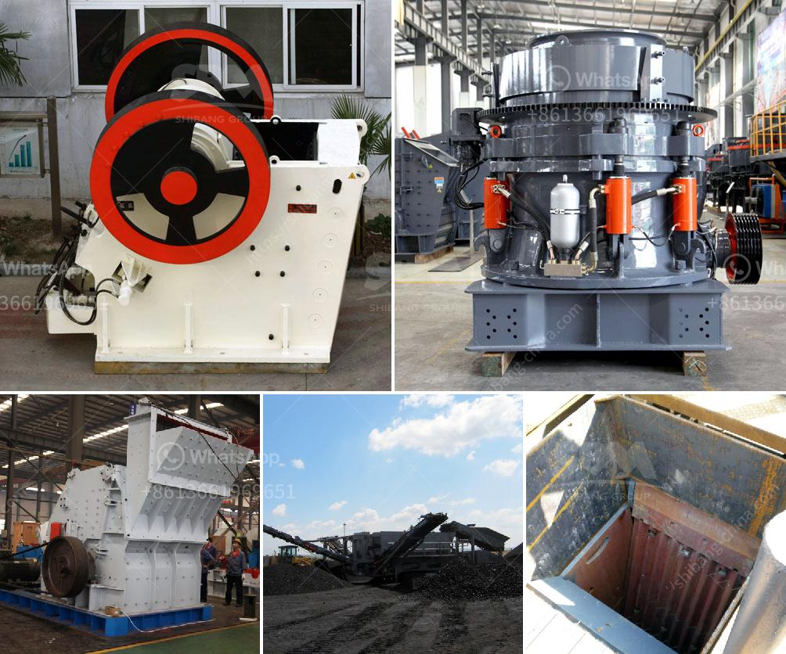

<h3>brick crushers for sale in australia</h3>
Brick crushers for sale in Australia may be purchased on a variety of websites or through local distributors. It is very important to do thorough research before making any purchases to ensure that you are maximizing value for your money. When looking for brick crushers for sale, you will find that there are several different options available to you. The type of crusher you choose will depend on the nature of the project and the amount of bricks you need to crush.

One option is a manual brick crusher. These crushers are highly affordable, and they do not require any external power sources. They are compact and can easily be transported from site to site. Manual brick crushers are perfect for projects that involve a limited amount of bricks. They are also useful for individuals who only need to crush bricks occasionally.

For larger projects, an electric or diesel-powered brick crusher is recommended. These crushers have a high processing capacity and can crush a large number of bricks in a relatively short amount of time. They are ideal for commercial or industrial applications, where a large volume of bricks needs to be crushed on a regular basis.

When considering brick crushers for sale in Australia, there are several factors that you need to take into account. Firstly, the size of the machine will determine its suitability for your project. It is important to consider the space available on your worksite and the capacity you require. Additionally, you need to consider the power requirements of the machine. If you do not have access to electricity or a suitable power source, a manual crusher may be a better option.

Another important factor to consider is the price. Brick crushers vary widely in price, depending on the size and functionality of the machine. It is important to set a realistic budget and compare prices from different suppliers. You may be able to find great deals by purchasing a used crusher. However, always ensure that the machine is in good working condition and will meet your requirements.

It is also important to consider the reputation of the supplier when purchasing a brick crusher in Australia. Research the company's background and read customer reviews to ensure that they are reputable and reliable. This will help you avoid any potential scams or disappointments.

In conclusion, brick crushers for sale in Australia are available in various sizes and types. It is important to do thorough research and consider your specific needs and budget before making a purchase. Whether you opt for a manual or electric/diesel-powered crusher, always ensure that you are purchasing from a reputable supplier. By following these guidelines, you can find the perfect brick crusher for your project and maximize the value for your money.
<h3>Contact us</h3><ul><li><strong>Whatsapp:&nbsp;<a href="https://wa.me/8613661969651">+8613661969651</a></strong></li><li><a href="https://swt.shibang-china.com/?git&amp;zhl&amp;brick crushers for sale in australia"><strong>Online Service(chat now)</strong></a></li></ul><h3>Related</h3><ul><li><a href='crusher plant supplier.md'>crusher plant supplier</a></li><li><a href='crushing plant manufacturers in kenya for quartz.md'>crushing plant manufacturers in kenya for quartz</a></li><li><a href='100tph jaw crusher and ball mill.md'>100tph jaw crusher and ball mill</a></li><li><a href='30 x 42 portable jaw crusher for sale.md'>30 x 42 portable jaw crusher for sale</a></li><li><a href='concrete crushing companies in nigeria.md'>concrete crushing companies in nigeria</a></li></ul>