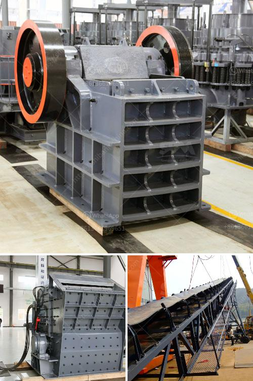

<h3>business plan and cost for crushing project</h3>
A business plan is a crucial element for any business idea, including a crushing project. It is a document that outlines the objectives, strategies, and financial projections for the proposed project. In this article, we will explore the essential aspects of a business plan and the costs associated with a crushing project.

1. Executive Summary: The business plan should begin with an executive summary that provides a brief overview of the crushing project. It should include the project's goals, target market, and a summary of the financial projections.

2. Company Description: This section provides a detailed description of the company undertaking the crushing project. It includes information about the company's history, legal structure, mission statement, and key personnel.

3. Market Analysis: A thorough market analysis is essential to understand the demand for the crushing project. It involves researching the industry, identifying competitors, and analyzing the target market's size, preferences, and trends.

4. Product or Service: The business plan should define the specific product or service being offered in the crushing project. It should outline its features, benefits, and unique selling proposition that differentiates it from competitors.

5. Marketing and Sales Strategy: This section outlines the marketing activities and sales strategies to promote and sell the product. It should include pricing, distribution channels, and customer acquisition strategies.

6. Operational Plan: This section focuses on the operational aspects of the crushing project. It includes information about the location, facilities, equipment, and technology required to run the project efficiently.

7. Financial Projections: One of the most critical components of a business plan is the financial projections. It includes the projected income statement, cash flow statement, and balance sheet for the project. The costs associated with the crushing project, including capital expenses, operational expenses, and monthly expenditures, should be estimated in this section.

Costs associated with a crushing project can vary depending on various factors such as project scale, location, and equipment requirements. Here are some of the significant costs involved:

1. Capital Expenses: This includes the initial investment required to set up the crushing project, including land acquisition, construction or leasing of the facility, purchase of equipment, vehicles, and machinery.

2. Operational Expenses: These are the ongoing expenses incurred in running the crushing project. It includes employee salaries, utilities, maintenance costs, raw material procurement, and transportation costs.

3. Marketing and Promotion Costs: To create awareness and attract customers, a certain budget is required for marketing and promotional activities. This includes advertising, digital marketing campaigns, public relations, and promotions.

4. Administrative Costs: These include costs associated with managing the project, such as office rent, legal and accounting fees, insurance, and permits.

5. Miscellaneous Expenses: Miscellaneous expenses may include contingency funds, training costs, and any unexpected expenses that may arise during the project.

In conclusion, a well-structured business plan is vital for the success of a crushing project. It helps investors and stakeholders understand the project's feasibility, profitability, and risks. Furthermore, accurately estimating the costs associated with the project is crucial for financial planning and decision-making. By carefully considering all the aspects, a well-prepared business plan can increase the chances of obtaining funding and ultimately turning the crushing project into a profitable venture.
<h3>Contact us</h3><ul><li><strong>Whatsapp:&nbsp;<a href="https://wa.me/8613661969651">+8613661969651</a></strong></li><li><a href="https://swt.shibang-china.com/?git&amp;zhl&amp;business plan and cost for crushing project"><strong>Online Service(chat now)</strong></a></li></ul><h3>Related</h3><ul><li><a href='grinding machine its operation principle.md'>grinding machine its operation principle</a></li><li><a href='mini mining crusher dealers.md'>mini mining crusher dealers</a></li><li><a href='fly ash electrostatic separator manufacturer.md'>fly ash electrostatic separator manufacturer</a></li><li><a href='open pit mobile crushing plant.md'>open pit mobile crushing plant</a></li><li><a href='high performance mobile crushing machine for sale.md'>high performance mobile crushing machine for sale</a></li></ul>