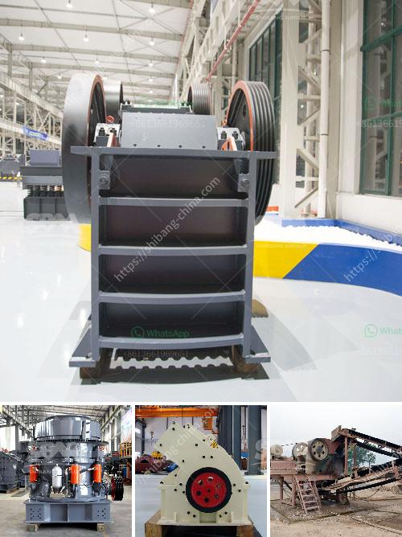

<h3>business plan for gypsum production</h3>
A business plan for gypsum production is crucial as it lays out the objectives, strategies, and financial projections for a company to be successful in this industry. Gypsum, also known as calcium sulfate dihydrate, is a mineral widely used in various industries such as construction, agriculture, and medical. With a strong demand for gypsum products, starting a gypsum production business can be a profitable venture.

The first step in creating a business plan for gypsum production is conducting thorough market research. This research should identify the target market, current demand, competitors, and potential customers. Understanding the market dynamics will help in identifying the specific products and services that will be offered by the business, along with the pricing and distribution strategy.

Once the target market is identified, defining the mission and vision of the company becomes the next significant step. This will help in setting the overall goals and objectives of the business. For example, if the goal is to become the leading provider of gypsum products in a specific region, the business plan should outline strategies to achieve this objective. These strategies may include partnerships with distributors, expanding production capacity, and developing a strong brand image.

Next, the business plan should focus on the production process and the required infrastructure. This includes outlining the machinery and equipment needed for gypsum production, as well as estimating the costs involved. It is essential to have a clear understanding of the manufacturing process and the required resources to ensure a smooth production flow.

Moreover, the business plan should address the marketing and sales strategy. This includes identifying target customers, developing promotional activities, and establishing a distribution network. The marketing efforts should focus on creating awareness about the company's products and building a reputation for high-quality gypsum. Building relationships with contractors, architects, and other industry professionals can also contribute to the success of the marketing strategy.

Additionally, the business plan should outline the financial projections for the business. This includes estimating the costs of raw materials, manufacturing, marketing, and other overhead expenses. It is crucial to project the revenues accurately based on the market demand and pricing strategy. Financial projections should also include the expected profits, cash flow, and return on investment. This information is vital for attracting potential investors or securing business loans.

Lastly, a business plan for gypsum production should include a risk analysis and contingency plan. Identify potential risks such as changes in market demand, regulatory constraints, or disruptions in the supply chain. Developing contingency plans to mitigate these risks will demonstrate preparedness and resilience to potential investors or business partners.

In conclusion, a business plan for gypsum production is critical to ensure a successful venture in this industry. It provides a roadmap for achieving objectives, outlines the production process and infrastructure requirements, identifies target markets, and establishes financial projections. By following a well-thought-out business plan, entrepreneurs can navigate the challenges of the gypsum production industry and increase their chances of success.
<h3>Contact us</h3><ul><li><strong>Whatsapp:&nbsp;<a href="https://wa.me/8613661969651">+8613661969651</a></strong></li><li><a href="https://swt.shibang-china.com/?git&amp;zhl&amp;business plan for gypsum production"><strong>Online Service(chat now)</strong></a></li></ul><h3>Related</h3><ul><li><a href='ball mill machine price in india.md'>ball mill machine price in india</a></li><li><a href='jaw crusher pe.md'>jaw crusher pe</a></li><li><a href='sales of conveyor belts.md'>sales of conveyor belts</a></li><li><a href='slinger conveyor belt speed.md'>slinger conveyor belt speed</a></li><li><a href='coal seal of coal pulverizer.md'>coal seal of coal pulverizer</a></li></ul>