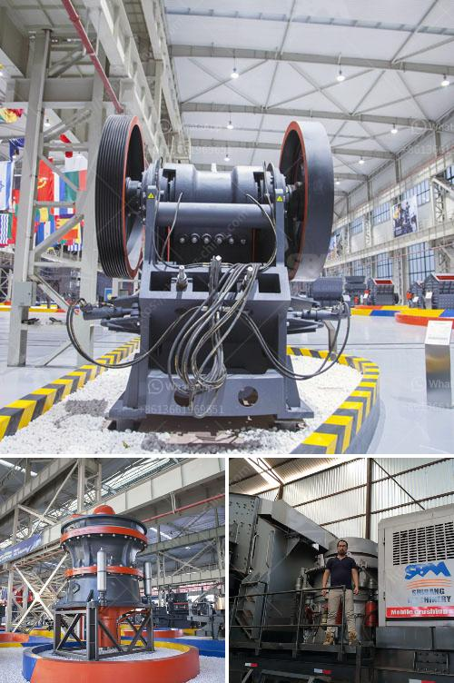

<h3>business plan of stone crushing companies</h3>
A stone crushing business plan is a formal statement of a set of business goals they want get, the reasons they are believed attainable, and the detailed plans for reaching those goals. In most cases, the Stone Crushers come up in clusters of number of units ranging from five to fifty in one cluster. The crushers are located nearer to the source of raw material such as Stone mines, River Beds etc.

The business purpose for which the rock crusher is to be used can influence the type of rock crushers you need to think about. For instance, if your business model involves mining, processing and selling mineral products such as crushed stone or sand, you need to invest in a jaw crusher, cone crusher or impact crusher. However, if your business primarily involves concrete and asphalt recycling, a portable rock crusher machine might be better suited for your needs.

When creating a business plan for a stone crushing company, it’s important to consider factors such as market demand, availability of raw material, and competition. These factors will shape the strategy you need to employ in order to succeed in your business. Additionally, it’s essential to take into account the financial aspects of the business, including start-up costs, operational costs, and projected revenue.

1. Executive Summary: A brief overview of the company, its mission, and the products/services it offers.

2. Market Analysis: An evaluation of the market demand for stone crushing services/products, an assessment of competitors, and an identification of target customers.

3. Operational Plan: Detailed information about the equipment and facilities required to run the business, including costs and purchasing options.

4. Marketing Strategy: A plan for promoting the company and attracting customers through various marketing channels such as online advertising, social media, and networking.

5. Financial Projections: A comprehensive financial analysis that includes projected revenue, expenses, and profit margins over a specific period of time.

When it comes to starting a stone crushing business, a comprehensive business plan is essential for success. It acts as a roadmap, guiding the management team and providing a clear direction for the company. With thorough planning and strategic thinking, a stone crushing business can thrive and contribute to the growth of the construction industry.
<h3>Contact us</h3><ul><li><strong>Whatsapp:&nbsp;<a href="https://wa.me/8613661969651">+8613661969651</a></strong></li><li><a href="https://swt.shibang-china.com/?git&amp;zhl&amp;business plan of stone crushing companies"><strong>Online Service(chat now)</strong></a></li></ul><h3>Related</h3><ul><li><a href='jaw crusher production line diagram.md'>jaw crusher production line diagram</a></li><li><a href='buy stone crushing machine in kenya.md'>buy stone crushing machine in kenya</a></li><li><a href='concrete stone crusher machine for sale in south africa.md'>concrete stone crusher machine for sale in south africa</a></li><li><a href='construction construction belt.md'>construction construction belt</a></li><li><a href='cement crusher plant macheniary.md'>cement crusher plant macheniary</a></li></ul>