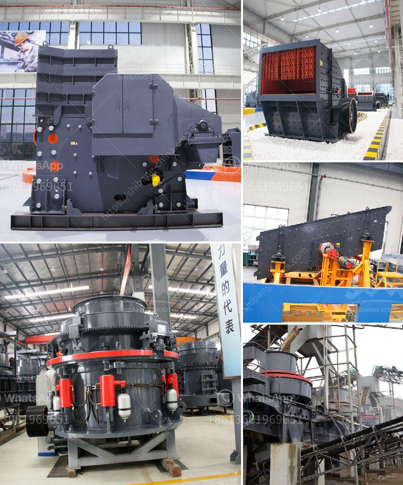

<h3>buy crusher of impact of 10 tph</h3>
In the dynamic world of mining operations, efficiency and productivity are key factors to stay competitive. When it comes to crushing operations, having the right tool for the job is crucial. One such tool is the impact crusher, a versatile machine capable of handling various types of materials with ease. In this article, we will explore the benefits and applications of an impact crusher, specifically focusing on a 10 tph capacity unit.

An impact crusher is a machine designed to break down large rocks into smaller, more manageable pieces. It utilizes high-speed collisions between the hammer and the materials being crushed to create the desired size reduction. Impact crushers are known for their unique ability to produce a high percentage of cubical-shaped end products, making them an ideal choice for various industries.

1. Versatility: The impact crusher is highly versatile, capable of handling a wide range of materials, including minerals, rocks, and ores. It can easily crush both soft and hard materials, making it suitable for diverse applications in the mining industry.

2. Efficient Crushing: With its high rotational speed and powerful impact force, an impact crusher efficiently breaks down materials into smaller sizes. Compared to traditional crushing methods, impact crushers have been found to be more energy efficient, resulting in reduced operating costs.

3. Precise Control: Impact crushers offer precise control over the final product size. By adjusting the gap between the impact plates and the rotor, operators can fine-tune the desired output size for different specifications. This level of control enables businesses to meet specific end-product requirements, enhancing overall customer satisfaction.

4. Durable and Low Maintenance: Selecting a high-quality impact crusher ensures long-term durability and minimal maintenance requirements. Modern designs often incorporate advanced technologies, such as self-lubricating systems and high-strength materials, to enhance the unit's lifespan and reduce downtime, leading to increased productivity.

5. Environmental Friendliness: Impact crushers produce less dust and noise compared to traditional crushing methods. This makes them an environmentally friendly choice, meeting the growing demand for sustainable mining practices in today's industry.

A 10 tph impact crusher, with its compact design and high-performance capabilities, is a suitable option for small to medium-sized mining businesses. It can handle various materials, including limestone, shale, granite, and concrete, effectively crushing them into desired sizes for further processing or sale.

In a constantly evolving mining industry, having the right equipment is essential for success. An impact crusher, with its versatile nature and efficient crushing capabilities, offers significant advantages for mining operations. The inclusion of a 10 tph capacity impact crusher in your arsenal can help enhance productivity, reduce operating costs, and meet specific end-product requirements. Investing in a quality impact crusher is a wise choice for any mining business striving to stay competitive and efficient in today's market.
<h3>Contact us</h3><ul><li><strong>Whatsapp:&nbsp;<a href="https://wa.me/8613661969651">+8613661969651</a></strong></li><li><a href="https://swt.shibang-china.com/?git&amp;zhl&amp;buy crusher of impact of 10 tph"><strong>Online Service(chat now)</strong></a></li></ul><h3>Related</h3><ul><li><a href='feasibility study quartz stone.md'>feasibility study quartz stone</a></li><li><a href='portable concrete crusher for rent qatar.md'>portable concrete crusher for rent qatar</a></li><li><a href='crushing plant for sale in.md'>crushing plant for sale in</a></li><li><a href='robinson henry roller mills.md'>robinson henry roller mills</a></li><li><a href='crusher machine philippines.md'>crusher machine philippines</a></li></ul>