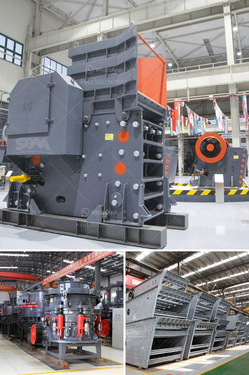

<h3>buy stone crusher in south africa</h3>
South Africa is renowned for its massive mineral reserves, with an abundance of gold, diamond, platinum and coal. Other minerals found in the nation include copper, iron ore, uranium, chrome, manganese, titanium and vermiculite. Despite this vast array of resources, the mining industry in South Africa faces numerous challenges, including decreasing productivity, high labor costs, and stringent environmental regulations.

In recent years, the demand for stone crushers in South Africa has been steadily growing. As a result, the market for crushing equipment is extremely competitive. To survive in this tough market, suppliers of stone crushers must become more innovative and focus on enhancing the efficiency and performance of their products.

One way to achieve this is to invest in the latest technology. By incorporating state-of-the-art features into their stone crushers, manufacturers can offer machines that are faster, more reliable, and easier to maintain. This can lead to increased productivity and reduced downtime for the end-users.

Another crucial factor for success in the South African market is after-sales service. Stone crushers are complex machines that require regular maintenance and repair. To ensure customer satisfaction, suppliers must have a strong service network and offer prompt and efficient support.

Additionally, the rising awareness of environmental concerns has prompted the need for more sustainable crushing solutions. Stone crusher manufacturers should invest in developing environmentally friendly equipment that minimizes pollution and reduces energy consumption. This will not only meet regulatory requirements but also attract environmentally conscious customers.

For potential buyers in South Africa, it is essential to do thorough research and compare various stone crusher options before making a purchase. Consider factors such as price, quality, after-sales service, and environmental impact. It is also advisable to consult with industry experts and seek recommendations from existing users.

Buying a stone crusher in South Africa can be a challenging task, but with proper planning and understanding, it can be a worthwhile investment. By investing in the right equipment and implementing the best practices, buyers can maximize their returns and contribute to the growth of the mining industry in South Africa.
<h3>Contact us</h3><ul><li><strong>Whatsapp:&nbsp;<a href="https://wa.me/8613661969651">+8613661969651</a></strong></li><li><a href="https://swt.shibang-china.com/?git&amp;zhl&amp;buy stone crusher in south africa"><strong>Online Service(chat now)</strong></a></li></ul><h3>Related</h3><ul><li><a href='stone quarry equipment price in ethiopia.md'>stone quarry equipment price in ethiopia</a></li><li><a href='how much is cost of jaw crusher.md'>how much is cost of jaw crusher</a></li><li><a href='stone crushing industry tanzania.md'>stone crushing industry tanzania</a></li><li><a href='copper ore crushing plant in chile.md'>copper ore crushing plant in chile</a></li><li><a href='100tpd cement grinding unit cost.md'>100tpd cement grinding unit cost</a></li></ul>