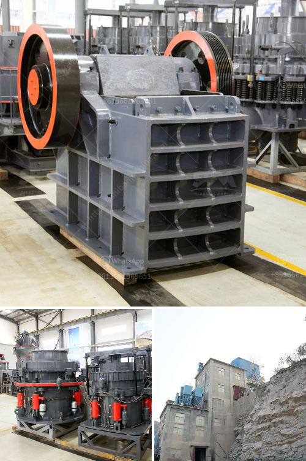

<h3>buy stone crusher</h3>
Buying a stone crusher is a significant investment for businesses. This is why it's important to do ample research before making a purchase decision. At first glance, it may seem that a stone crusher machinery is an essential equipment for businesses. However, you need to look beyond its initial cost and think about how purchasing a stone crusher machinery is going to affect your overall budget. For instance, you need to consider factors like maintenance costs, fuel efficiency, and longevity of the machine.

One of the primary reasons why people consider buying a stone crusher machinery is because they are going to be using it for a long period of time. This means that the machine should be durable and should have a long lifespan. You need to make sure that the stone crusher you are buying is of good quality and made from high-quality materials. It's prudent to check the reputation of the manufacturer and read reviews about their stone crushers. This will give you an idea of the quality of their products and their commitment to customer satisfaction.

Maintenance costs are also an important factor to consider when buying a stone crusher machinery. Regular maintenance is crucial to keep the machine running smoothly and efficiently. You should inquire about the maintenance schedule and the costs associated with it. Some stone crushers may require more frequent maintenance, which could increase your overall operational costs. On the other hand, buying a stone crusher that requires minimal maintenance can save you a lot of money in the long run. It's advisable to opt for a stone crusher machinery that comes with a warranty so that any potential repairs or replacements can be covered.

Fuel efficiency is another crucial factor to consider when buying a stone crusher machinery. The price of diesel and gasoline can fluctuate frequently, and it's essential to choose a stone crusher that has fuel-efficient engine options. This will help you save money on operating costs. It's also worth noting that fuel-efficient stone crushers are also more environmentally friendly as they produce fewer emissions.

In addition to fuel efficiency, you should also consider the size and capacity of the stone crusher machinery. The size should be appropriate for your specific needs. If you need a stone crusher for large-scale projects, opting for a larger, high-capacity machine makes sense. However, if you only require a stone crusher for occasional use, a smaller, more portable option might be more suitable. It's crucial to find the right balance between size and capacity to ensure optimal performance and efficiency.

Lastly, you must consider the overall cost-effectiveness of buying a stone crusher machinery. Apart from the initial purchase cost, you should also factor in operational costs, maintenance costs, and potential resale value if you plan to replace the machine in the future. It's always a good idea to compare prices from different manufacturers and choose the one that offers the best value for your money.

In conclusion, buying a stone crusher machinery is a significant investment that requires careful consideration. Take your time to research and compare different options to find the one that suits your specific needs. Consider factors like durability, maintenance costs, fuel efficiency, size, and overall cost-effectiveness. By making an informed decision, you can ensure that your stone crusher machinery will be a valuable asset for your business for years to come.
<h3>Contact us</h3><ul><li><strong>Whatsapp:&nbsp;<a href="https://wa.me/8613661969651">+8613661969651</a></strong></li><li><a href="https://swt.shibang-china.com/?git&amp;zhl&amp;buy stone crusher"><strong>Online Service(chat now)</strong></a></li></ul><h3>Related</h3><ul><li><a href='100tpd cement grinding unit cost.md'>100tpd cement grinding unit cost</a></li><li><a href='how to calculate grinding media in cement mill.md'>how to calculate grinding media in cement mill</a></li><li><a href='quartz crushing plant.md'>quartz crushing plant</a></li><li><a href='gold refining machine capacity 2 tons per day.md'>gold refining machine capacity 2 tons per day</a></li><li><a href='quarry crusher in nigeria.md'>quarry crusher in nigeria</a></li></ul>