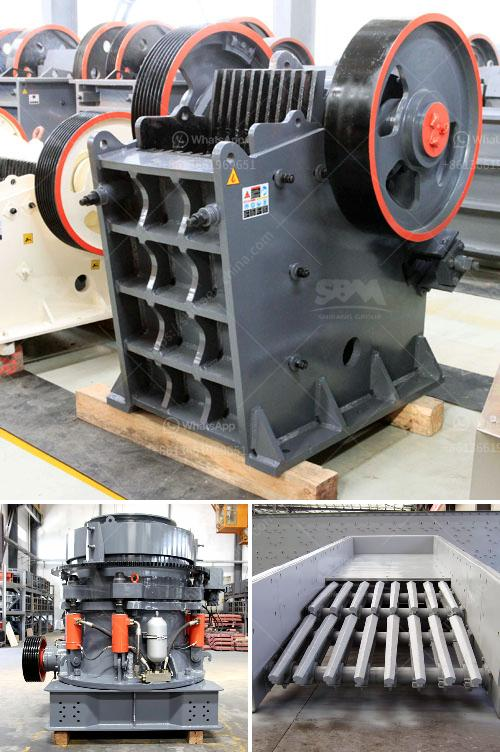

<h3>buy stone crushing machine in kenya</h3>
When it comes to purchasing a stone crushing machine, most of the people faced with the dilemma of choosing the best one. With the huge range of options available, it can be a daunting task to determine which machine will suit your requirements the best. Today, I will introduce to you a trustworthy crushing machine exporter supplier. Kenya is located in eastern Africa, the equator across the central of Kenya. Great Rift Valley is running north and south. Kenya is adjacent to Somalia in the east, Tanzania in the south, Uganda in the west, and South Sudan in the northwest. The coastline of the Indian Ocean is abundant with high-quality stones. With such a huge mineral stone resource, Kenya could be a potential market for the crushing industry.

Stone crushing machine is widely used in various materials processing of mining &construction industries, such as it is suit for crushing granite, marble, basalt, limestone, quartz, cobble, iron ore, copper ore, and some other mineral &rocks. SBM crushing machine in kenya,SBM stone crushing machine is an ideal solution as a crusher following a stationary one. Crushing machines are used for the purpose of reducing the size of materials. The stone crushing machine manufactured by SBM corporation includes jaw crusher, impact crusher, cone crusher, hammer crusher and mobile crusher. Further, SBM stone crushing machine can be divided into two, like fixed crusher plant and mobile crusher plant.

To keep the leading position in Kenya, SBM Company’s invests and improves the R&D team to develop a more efficient stone crushing machine. Many customers in Kenya are interested into the diesel engine ballast crushing machine, here I will introduce some hot small models for small mining and quarry plant.

Diesel engine stone ballast crusher machine is a type of diesel engine crusher. There is a simple type diesel engine stone ballast crushing machine, which is an only ballast crusher machine with a diesel engine. But now I introduce is a model which the crusher and diesel engine crusher are on a structure together, which is the ballast crusher machine. The equipment can be driven by electric motor, or diesel engine. Additionally, low operation cost, the quality of finished products is even, good-shaped and can be adjustable. With high crushing ratio, low power consumption, high capacity, low pollution and easy maintenance, this stone crushing machine is widely utilized in quarrying, mining, construction, gravel processing, and other fields.

For those different sizes of stones, there are different types of crushing machines in Kenya. Mini jaw crusher is the most common used crusher in stone crushing; while the large scale type is for secondary crushing plant or tertiary crushing plant. SBM jaw crushing machine has many models for different requirements. Meanwhile, another SBM jaw crusher will be a necessary machine for the different stone materials. For example, when people want to crush limestone with high-hardness degree, SBM machinery is pushing out the adopting new technology XPCF series high efficient fine crusher, which is specialized in crushing limestone, cobble, and other stone materials. Its biggest feeding size is up to about 25mm and finished products size can be adjustable. In conclusion, SBM stone crushing machine company provides affordable jaw crusher machines on the market. Jaw Crusher Type Jaw crusher ensures the high-quality final product.

So, if you are looking to invest in a stone crushing machine in Kenya, you have made a wise choice. With investment opportunities in stone crushing industry, Kenya is witnessing a surge in demand for various types of crushers sourced from leading manufacturers in the world. So, if you are looking for stone crushers for sale in Kenya, SBM is your best choice. We are a global manufacturer of stone crushing equipment and grinding equipment. We offer complete crushing plant, Our main Product include jaw crusher,cone crusher,impact crusher,VSI crusher,pulverizerand other related crushing machines. If you want to learn more information about our products, please feel free to contact us!
<h3>Contact us</h3><ul><li><strong>Whatsapp:&nbsp;<a href="https://wa.me/8613661969651">+8613661969651</a></strong></li><li><a href="https://swt.shibang-china.com/?git&amp;zhl&amp;buy stone crushing machine in kenya"><strong>Online Service(chat now)</strong></a></li></ul><h3>Related</h3><ul><li><a href='stone crusher zone in nepal.md'>stone crusher zone in nepal</a></li><li><a href='buy crusher of impact of 10 tph.md'>buy crusher of impact of 10 tph</a></li><li><a href='jaw crusher suppliers south africa.md'>jaw crusher suppliers south africa</a></li><li><a href='stone crusher machinery china.md'>stone crusher machinery china</a></li><li><a href='vertical roller mill manufacturers.md'>vertical roller mill manufacturers</a></li></ul>